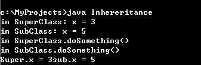
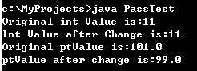
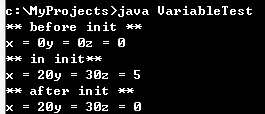
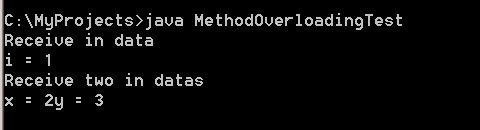

# 面向对象编程

# JAVA 面向对象基础

# 面向对象
## 封装的原则

要求使对象之外的部分不能随意存取对象的内部数据，从而有效避免了错误对它的“交叉感染”，使软件错误能局部化，降低排错难度

## 继承

所有的类都继承自 java.lang.Object，一些常用的方法：

equals():比较两个对象引用时否相同。

getClass():返回对象运行时所对应的类的表示，从而得到相应的信息

toString():返回对象字符串表示

finalize():用于在垃圾收集前清除对象

notify(), notifyall(), wait(): 用于多线程处理中的同步

子类（subclass）对父类（superclass，超类）的继承

子类不能继承父类中访问权限为 private 的成员变量和方法。

子类可以重写父类的方法，及命名与父类同名的成员变量。

Java 不支持多重继承

创建子类

```
　　　　class SubClass extends SuperClass {

　　　　　　...

　　　　}
```

成员的隐藏和方法的重写

子类通过隐藏父类的成员变量和重写父类的方法，可以把父类的状态和行为变为自身的状态和行为。

## 多态性
子类继承父类后，同一个方法有不同的表现

体现在两个方面：方法重载实现的静态多态性（编译时多态），方法重写实现的动态多态性（运行时多态）

重写方法的调用原则：子类重写父类的方法，调用子类方法；反之，调用父类的方法

一个对象可以引用子类的实例来调用子类的方法

eg: B 继承 A，A 的对象 a 引用 B 的实例，调用 B 的方法 callme()

```
import java.io.*;
class A {
    void callme() {
        System.out.println("Inside A's callme()) method");
    }
}

class B extends A {
    void callme() {
        System.out.println("Inside B's callme() method");
    }
}

public class Dispatch {
    public static void main(String args[]) {
        A a = new B(); // 引用子类的实例
        a.callme(); 
    }
}
```


## 类的实现
类声明
```
　　　　[public][abstract|final] class className [extends superclassName] [implements interfaceNameList] {}
　　　　　　修饰符public, abstract, final说明类的属性
　　　　　　className为类的属性
　　　　　　superclassName为父类的名字
　　　　　　interfaceNameList为类所实现的接口列表
```

类体

```
　　　　class className
　　　　{
　　　　　　[public | protected | private] [static] [final] [transient] [volatile] type variableName; // 成员变量
　　　　　　[public | protected | private] [static] [final | abstract] [native] [synchronized] returnType methodName(
　　　　　　　　[paramList]) [throws exceptionList] {statements}; //成员方法
　　　　}
```

成员变量

```
　　　　[public | protected | private] [static] [final] [transient] [volatile] type variableName; // 成员变量
　　　　　　static: 静态变量（类变量）
　　　　　　final: 常量
　　　　　　transient：暂时性变量，用于对象存档
　　　　　　volatile：共享变量，用于并发线程的共享
```

成员方法

```
　　　　[public | protected | private] [static] [final | abstract] [native] [synchronized] returnType methodName(
　　　　[paramList]) [throws exceptionList] {statements}; //成员方法
　　　　　　static: 类方法，可通过类名直接调用
　　　　　　abstract: 抽象方法，没有方法体
　　　　　　final：方法不能被重写
　　　　　　native：集成其他语言的代码
　　　　　　synchronized：控制多个并发线程的访问
```

Java 类中的限定词：

private：类中限定为 private 的成员，只能被这个类本身访问。如果构造方法为 private，则其他类不能实例化该类。

default：不加任何访问权限，可以被这个类本身和同一个包中的类访问。

protected：类中限定为 protected 的成员，可以被这个类本身、它的子类和同一个包中的其他类访问。

public：类中被限定为 public 的成员，可以被所有类访问。

final 关键字可以修饰类、类的成员变量和成员方法，但作用不同

修饰成员变量：称为常量，须给出初始值

修饰成员方法：该方法不能被子类重写

修饰类：类不能被继承

super: 访问父类的成员　

访问父类被隐藏的成员变量，如 super.variable;

调用父类中被重写的方法，如 super.Method([paramlist]);

调用父类的构造函数，如 super([paramlist]);

eg:

```
import java.io.*;
class SuperClass {
    int x;

    SuperClass() {
        x = 3;
        System.out.println("in SuperClass: x = " + x);
    }

    void doSomething() {
        System.out.println("in SuperClass.doSomething()");
    }
}

class SubClass extends SuperClass {
    int x;

    SubClass() {
        super();
        x = 5;
        System.out.println("in SubClass: x = " + x);
    }

    void doSomething() {
        super.doSomething();
        System.out.println("in SubClass.doSomething()");
        System.out.println("Super.x = " + super.x + "sub.x = " + x);
    }
}

public class Inhereritance {

    public static void main(String chars[]) {
        SubClass sc = new SubClass();
        sc.doSomething();
    }
}
```



## 简单数据：值类型
复合数据：引用类型

```
import java.io.*;
public class PassTest {
    float ptValue;

    public static void main(String args[]) {
        int val;
        PassTest pt = new PassTest();
        val = 11;
        System.out.println("Original int Value is:"+val);
        pt.changeInt(val);
        System.out.println("Int Value after Change is:"+val);
        pt.ptValue = 101f;
        System.out.println("Original ptValue is:"+pt.ptValue);
        pt.changeObjectValue(pt); // 引用类型的参数
        System.out.println("ptValue after change is:"+pt.ptValue);

    }

    public void changeInt(int value) {
        value = 55;
    }

    public void changeObjectValue(PassTest ref) {
        ref.ptValue = 99f;
    }
}
```



简单数据类型作为参数传递时，为值传递；复合数据类型作为参数传递时，为地址传递

方法体
方法的实现。方法体中局部变量若与成员变量同名，局部变量将屏蔽成员变量。

```
import java.io.*;
class Variable {
    int x = 0, y = 0, z = 0; // 类的成员变量

    void init(int x, int y) {
        this.x = x;
        this.y = y;
        int z = 5;  // 局部变量
        System.out.println("** in init**");
        System.out.println("x = " + x + "y = " + y + "z = " + z);
    }
}

public class VariableTest {
    public static void main(String args[]) {
        Variable v = new Variable();
        System.out.println("** before init **");
        System.out.println("x = " + v.x + "y = " + v.y + "z = " + v.z);
        v.init(20, 30);
        System.out.println("** after init **");
        System.out.println("x = " + v.x + "y = " + v.y + "z = " + v.z);
    }
}
```



方法重载

指多个方法享有相同的名字。这些方法的参数必须不同。且参数类型区分度要足够：如不能使同一简单类型的数据：int 与 long

```
import java.io.*;

class MethodOverloading {
    void receive(int i) {
        System.out.println("Receive in data");
        System.out.println("i = " + i);
    }

    void receive(int x, int y) {
        System.out.println("Receive two in datas");
        System.out.println("x = " + x + "y = " + y);
    }
}

public class MethodOverloadingTest {
    public static void main(String args[]) {
        MethodOverloading mo = new MethodOverloading();
        mo.receive(1);
        mo.receive(2, 3);
    }
}
```



## 构造方法

一个特殊的方法。每个类都有构造方法，用来初始化该类的一个对象。

构造方法具有和类名相同的名称，不返回任何数据类型。

重载经常用于构造方法。

构造方法只能由 new 运算符调用

### 抽象类和抽象方法：

用 abstract 关键字修饰类:抽象类

用 abstract 关键字修饰方法：抽象方法

抽象类必须被继承，抽象方法必须被重写

抽象方法只需声明，无需实现

抽象类不能被实例化，抽象类不一定要包含抽象方法

若类中包含抽象方法，给类必须被定义为抽象类

## 接口

接口是抽象类的一种，只包含常量和方法的定义，没有变量和方法的实现，且其方法都是抽象方法。

用处体现在：

通过接口，实现不相关类的相同行为

通过接口，指明多个类需要实现的方法

通过接口，了解对象的交互界面，无需了解对象所对应的类

### 接口的定义：

接口声明：

```
[public] interface interfaceName[extends listOfSuperInterface] {...}
```

方法体定义：

```
returnType methodName([paramlist]);
```

接口的实现：

在类的声明中用 implements 子句来表示一个类使用某个接口

类体中可以使用接口中定义的常量，必须实现接口中定义的所有方法

一个类可以实现多个接口，在 implements 中用逗号隔开

接口类型的使用：

接口作为一种引用类型来使用

任何实现该接口的类的实例，都可以存储在该接口类型的变量中，通过这些实例，访问该类接口中的方法。