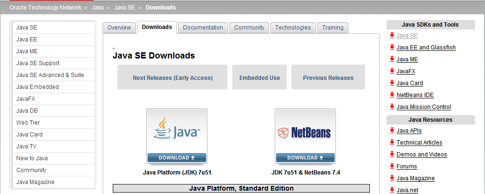
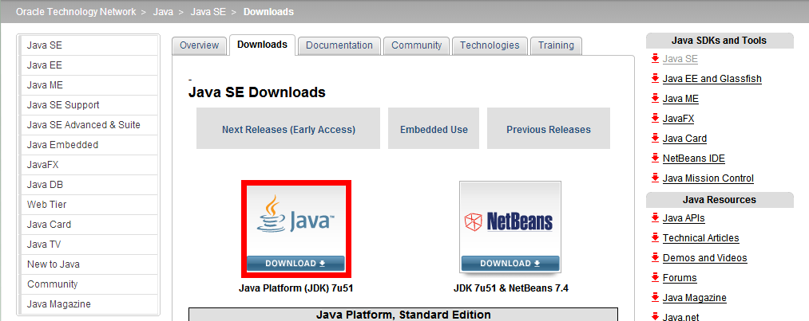
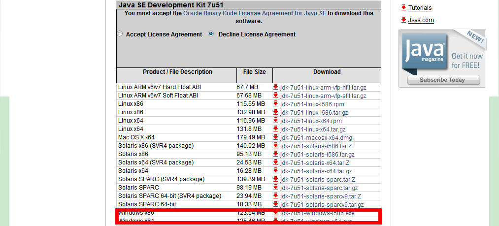
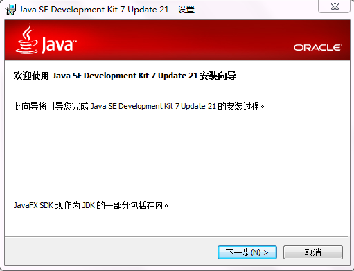
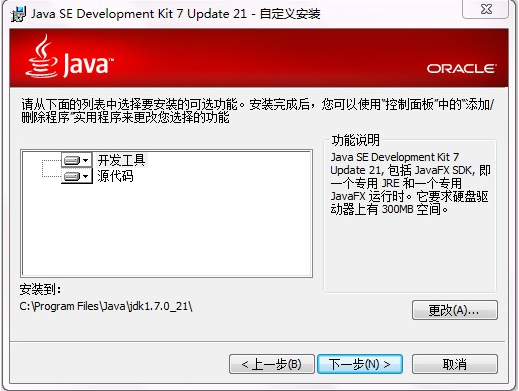
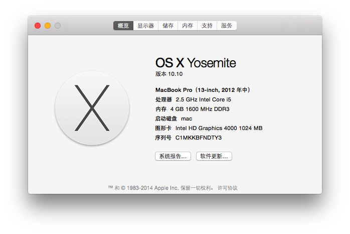
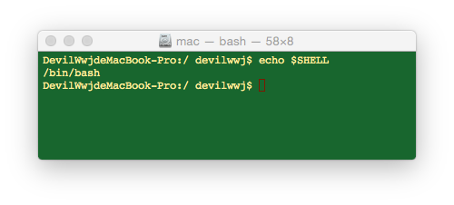
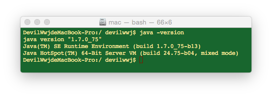
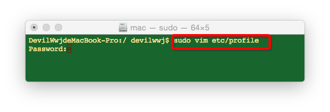
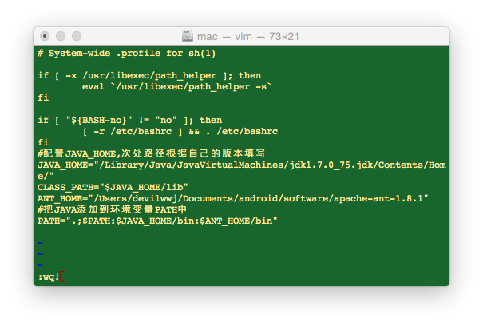

# 搭建 Java 开发环境

# 搭建 Java 开发环境

并不是每一台计算机都可以运行 Java 程序，要运行 Java 程序，计算机必须搭建 Java 开发环境，而编写 Java 程序则可以使用任何的文本编辑工具，如最简单的文本编辑工具之一——记事本。

**下载 JDK 的具体步骤如下：**

1、打开浏览器，在浏览器的地址栏里输入如下网址：

http://www.oracle.com/technetwork/java/javase/downloads/index.html

进入界面如下：

2、点击图中的红色区域

进入界面如下：

3、选择适合你系统类型的安装文件，进行下载。

**安装 JDK 的具体步骤如下：**

1、双击下载的 JDK 安装程序，进入安装界面，首先进入安装向导界面，如图：

2、单击“下一步”按钮，进入自定义安装界面，如图：

3、选择需要安装的程序，如果需要更改安装位置，可以单击“更改”按钮，选择安装位置。单击“下一步”按钮，开始安装。

注：在安装 JDK 时，没有快捷方式，也不需要快捷方式，因此里面的方法和类都是通过程序员编写的程序隐式调用的。

**Windows 系统下配置和测试 JDK**

安装完 JDK 后，需要设置环境变量及测试 JDK 配置是否成功，具体步骤如下：

1、在“计算机”图标上单击鼠标右键，选择“属性”命令，在打开的“高级系统设置”，对话框中选择“高级”选项卡；

2、单击“环境变量”按钮，打开“环境变量”对话框，在这里可以添加针对单个用户的“用户变量”和针对所有用户的“系统变量”；

3、单击“系统变量”栏中的“新建”按钮，弹出“编辑系统变量”对话框，在“变量名”文本框中输入“JAVA_HOME”，在“变量值”文本框中输入 JDK 的安装路径“C:\Program Files\Java\jdk1.6.0_24”，单击“确定”按钮，完成环境变量“JAVA_HOME”的配置。

4、在系统变量中，查看 Path 变量，如果不存在，则新建变量 Path，否则选择该变量，单击“环境变量”对话框中的“编辑”按钮，打开“编辑系统变量”对话框，在该对话框的“变量值”文本框的起始位置添加“%JAVA_HOME%\bin;”，单击 “确定”按钮完成环境变量的配置。

5、JDK 程序安装和配置完成后，可以测试 JDK 是否能够在计算机上运行，步骤是：选择“开始”--“运行”命令，在打开的“运行”对话框中输入“cmd”命令，确定后将进入到 DOS 环境中，在命令提示符后面直接输入“javac”，按下<Enter>键，系统会输出 javac 的帮助信息，说明已经成功配置了 JDK，否则需要仔细检查上面步骤的配置是否正确。

**Java 程序的开发过程**

开发 Java 程序总体上可以分为3步：

1、编写 Java 源文件。Java 源文件是一种文本文件，其扩展名为 .java。（如：X.java）

2、编译 Java 源文件，也就是将 Java 源文件编译（Compile）成 Java 类文件（扩展名为.class），如：使用“javac.exe”命令将 X.java 文件编译成“X.class”类文件。

Java 类文件由字节码构成，所以也可以称为字节码文件，所谓的字节码文件是与平台无关的二进制码，执行时由解释器（java.exe）解释成本地计算机码。一边解释一边执行，解释一句，执行一句。

3、运行 Java 程序。Java 程序可以分为 Java  Application（Java 应用程序）和 Java  Applet（Java 小应用程序）。其中，Java  Application 必须通过 Java 解释器来解释执行其字节码文件，Java  Applet 必须使用支持它的浏览器（IE 浏览器）运行。

# Mac OS X 下搭建 Java 开发环境图解

本篇博客介绍如何在 Mac osx 系统下搭建 java 开发环境，有了 java 的开发环境，我们就可以做 Java 相关的开发，Eclipse 和 Android Studio 都是要有 JVM 环境才能运行的，所以本篇就稍微总结一下如何在 Mac osx 下配置 java 环境变量。

先来看看笔者的电脑配置：

打开终端，查看10.10版本的系统使用的是什么 shell 命令：

输出的是 bash，说明是 Bourne shell，是默认的 Unix Shell 命令。

下面通过命令行查看笔者的 java 版本：

如果你的系统已经安装成功 JDK，通过 java -version 就可以看到相应的 jdk 版本。

如果你的电脑还没有安装 JDK 的话，可以到 Oracle 官网下载 jdk

http://www.oracle.com/technetwork/java/javase/downloads/jdk7-downloads-1880260.html

笔者下载的1.7版本，目前 jdk 最新版本为1.8。

配置 java 环境变量

输入 sudo vim etc/profile

使用 vi 编辑 profile 文件

键入 i,进入插入模式

在文件尾部，添加 java 路径

JAVA_HOME="/Library/Java/JavaVirtualMachines/jdk1.7.0_75.jdk/Contents/Home/"
CLASS_PATH="$JAVA_HOME/lib"
PATH=".;$PATH:$JAVA_HOME/bin"

添加完毕之后，按 esc 退出插入模式，并键入 wq! 保存退出文件。

到这个步骤，我们就已经配置好了全局的 java 的 path 和 classpath 环境变量。

以后就可以好好的进行 java 开发了，好嗨森！！！