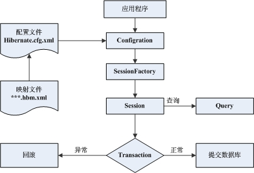

# Hibernate

# Hibernate 框架简述

## Hibernate 的核心组件
在基于 MVC 设计模式的 JAVA WEB 应用中，Hibernate 可以作为模型层/数据访问层。它通过配置文件(hibernate.properties 或 hibernate.cfg.xml)和映射文件(***.hbm.xml)把 JAVA 对象或 PO(Persistent Object,持久化对象)映射到数据库中的数据库，然后通过操作 PO，对数据表中的数据进行增，删，改，查等操作。
除配置文件，映射文件和持久化类外，Hibernate 的核心组件包括以下几部分：
a)Configuration 类：用来读取 Hibernate 配置文件，并生成 SessionFactory 对象。
b)SessionFactory 接口：产生 Session 实例工厂。
c)Session 接口：用来操作 PO。它有 get(),load(),save(),update()和 delete()等方法用来对 PO 进行加载，保存，更新及删除等操作。它是 Hibernate 的核心接口。
d)Query 接口：用来对 PO 进行查询操。它可以从 Session 的 createQuery()方法生成。
e)Transaction 接口：用来管理 Hibernate 事务，它主要方法有 commit()和 rollback()，可以从 Session 的 beginTrancation()方法生成。

## Persistent Object
持久化对象可以是普通的 Javabeans,惟一特殊的是它们与（仅一个）Session 相关联。 JavaBeans 在 Hibernate 中存在三种状态：
1. 临时状态(transient):当一个 JavaBean 对象在内存中孤立存在，不与数据库中的数据有任何关联关系时，那么这个 JavaBeans 对象就称为临时对象(Transient Object)。
2. 持久化状态(persistent):当一个 JavaBean 对象与一个 Session 相关联时，就变成持久化对象(Persistent Object)
3. 脱管状态(detached):在这个 Session 被关闭的同时，这个对象也会脱离持久化状态，就变成脱管状态(Detached Object)，可以被应用程序的任何层自由使用，例如可以做与表示层打交道的数据舆对象(Data Transfer Object)。

## Hibernate 的运行过程
Hibernate 的运行过程如下：
A:应用程序先调用 Configration 类，该类读取 Hibernate 的配置文件及映射文件中的信息，并用这些信息生成一个 SessionFactpry 对象。
B:然后从 SessionFactory 对象生成一个 Session 对象，并用 Session 对象生成 Transaction 对象;可通过 Session 对象的 get(),load(),save(),update(),delete()和 saveOrUpdate()等方法对 PO 进行加载，保存，更新，删除等操作;在查询的情况下，可通过 Session 对象生成一个 Query 对象，然后利用 Query 对象执行查询操作;如果没有异常，Transaction 对象将提交这些操作结果到数据库中。

Hibernate 的运行过程如下图：



Hibernate 简单示例：
数据：

```
create table T_register
(
    id    int primary key,
    userName varchar(30),
    userPwd varchar(30),
    sex varchar(10),
    age int
)
```

视图层：注册页面 register.jsp

```
<%@ page language="java" contentType="text/html; charset=GBK"
    pageEncoding="GBK"%>
<!DOCTYPE html PUBLIC "-//W3C//DTD HTML 4.01 Transitional//EN" "http://www.w3.org/TR/html4/loose.dtd">
<html>
<head>
<meta http-equiv="Content-Type" content="text/html; charset=GBK">
<title>Insert title here</title>
</head>
<body>

<form action="servlet/RegisterServlet" method="POST">
    用户名：<input type="text" name="userName" /><BR>
    密  码：<input type="text" name="userPwd" /><BR>
    性  别：<input type="text" name="sex" /><BR>
    年  龄：<input type="text" name="age" /><BR>
    <input type="submit" value="save" />
</form>
</body>
</html>
```

设计持久化类 TRegister.java

```
package hibernate.PO;
/**
 * 持久化类
 */

public class TRegister  implements java.io.Serializable {


    // Fields    

     private Integer id;
     private String userName;
     private String userPwd;
     private String sex;
     private Integer age;


    // Constructors

    /** default constructor */
    public TRegister() {
    }

    /** minimal constructor */
    public TRegister(Integer id) {
        this.id = id;
    }
    
    /** full constructor */
    public TRegister(Integer id, String userName, String userPwd, String sex, Integer age) {
        this.id = id;
        this.userName = userName;
        this.userPwd = userPwd;
        this.sex = sex;
        this.age = age;
    }

   
    // Property accessors

    public Integer getId() {
        return this.id;
    }
    
    public void setId(Integer id) {
        this.id = id;
    }

    public String getUserName() {
        return this.userName;
    }
    
    public void setUserName(String userName) {
        this.userName = userName;
    }

    public String getUserPwd() {
        return this.userPwd;
    }
    
    public void setUserPwd(String userPwd) {
        this.userPwd = userPwd;
    }

    public String getSex() {
        return this.sex;
    }
    
    public void setSex(String sex) {
        this.sex = sex;
    }

    public Integer getAge() {
        return this.age;
    }
    
    public void setAge(Integer age) {
        this.age = age;
    }
}
```

设计 Hibernate 配置文件 hibernate.cfg.xml

```
<?xml version='1.0' encoding='UTF-8'?>
<!DOCTYPE hibernate-configuration PUBLIC
          "-//Hibernate/Hibernate Configuration DTD 3.0//EN"
          "http://hibernate.sourceforge.net/hibernate-configuration-3.0.dtd">

<!-- Generated by MyEclipse Hibernate Tools.                   -->
<hibernate-configuration>

<session-factory>
    <property name="connection.username">root</property>
    <property name="connection.url">
        jdbc:mysql://localhost:3306/study
    </property>
    <property name="dialect">
        org.hibernate.dialect.MySQLDialect
    </property>
    <property name="myeclipse.connection.profile">MySQL5.0</property>
    <property name="connection.password">root</property>
    <property name="connection.driver_class">
        org.gjt.mm.mysql.Driver
    </property>
    <property name="show_sql">true</property>
    <mapping resource="hibernate/PO/TRegister.hbm.xml" />

</session-factory>

</hibernate-configuration>
```

设计映射文件 TRegister.hbm.xml

```
TRegister.hbm.xml 设计 hibernate 基础类 HibernateUtil.java
package hibernate;
/**
 * hibernate 基础类
 * @author fengyan
 * date 2007-01-09 02:32
 */
import org.hibernate.HibernateException;
import org.hibernate.Session;
import org.hibernate.SessionFactory;
import org.hibernate.cfg.Configuration;

public class HibernateUtil {
    
    private static final SessionFactory sessionFactory;
    
    static
    {
        try
        {
            Configuration config = new Configuration().configure("/hibernate/hibernate.cfg.xml");
            sessionFactory = config.buildSessionFactory();
        }
        catch(Throwable e)
        {
            throw new ExceptionInInitializerError(e);
        }
    }
    
    public static final ThreadLocal session = new ThreadLocal();
    
    public static Session currentSession() throws HibernateException
    {
        Session s = (Session)session.get();
        //Open a new Session,if this Thread has none yet
        if(s == null || !s.isOpen())
        {
            s = sessionFactory.openSession();
            session.set(s);
        }
        return s;
    }
    
    public static void closeSession() throws HibernateException
    {
        Session s = (Session)session.get();
        session.set(null);
        if(s != null)
            s.close();
    }

}
```

设计控制类

```
package hibernate.servlet;
/**
 * @author fengyan
 * date  2007-01-09 02:44
 * 设计Hibernate控制类
 */
import hibernate.HibernateUtil;
import hibernate.PO.TRegister;

import java.io.IOException;
import java.io.PrintWriter;

import javax.servlet.ServletException;
import javax.servlet.http.HttpServlet;
import javax.servlet.http.HttpServletRequest;
import javax.servlet.http.HttpServletResponse;

import org.hibernate.HibernateException;
import org.hibernate.Session;
import org.hibernate.Transaction;

public class RegisterServlet extends HttpServlet {

    private static final String CONTENT_TYPE = "text/html;charset=GBK";
    public void init() throws ServletException {
        // Put your code here
    }
    public void destroy() {
        super.destroy(); // Just puts "destroy" string in log
        // Put your code here
    }

    
    public void doGet(HttpServletRequest request, HttpServletResponse response)
            throws ServletException, IOException {

        response.setContentType(CONTENT_TYPE);
        request.setCharacterEncoding("GBK");
        
        PrintWriter out = response.getWriter();
        
        String userName = request.getParameter("userName");
        String userPwd = request.getParameter("userPwd");
        String sex = request.getParameter("sex");
        int age = Integer.parseInt(request.getParameter("age"));
        
        TRegister rg = new TRegister();
        rg.setAge(age);
        rg.setSex(sex);
        rg.setUserName(userName);
        rg.setUserPwd(userPwd);
        
        Session session = HibernateUtil.currentSession();//生成Session实例
        Transaction tx = session.beginTransaction();
        
        try
        {
            session.save(rg);    //保存持久类对象
            tx.commit();        //提交到数据库
            session.close();
            response.sendRedirect("registerOK.jsp");
        }
        catch(HibernateException e)
        {
            e.printStackTrace();
            tx.rollback();
        }
        
    }

    public void doPost(HttpServletRequest request, HttpServletResponse response)
            throws ServletException, IOException {
        doGet(request,response);
        
    }


}
```

编译----->打包----->运行----->OK！