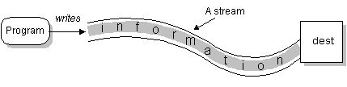
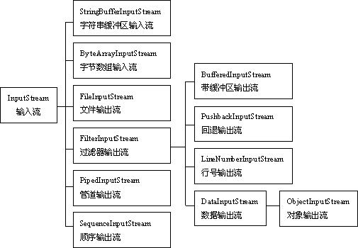
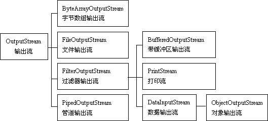
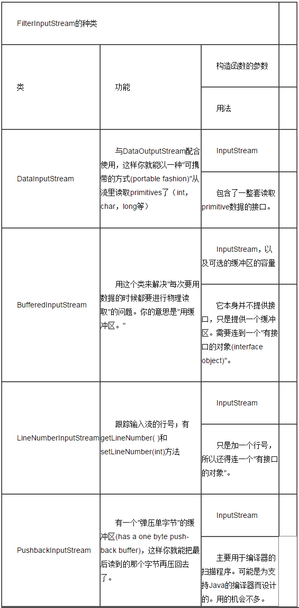
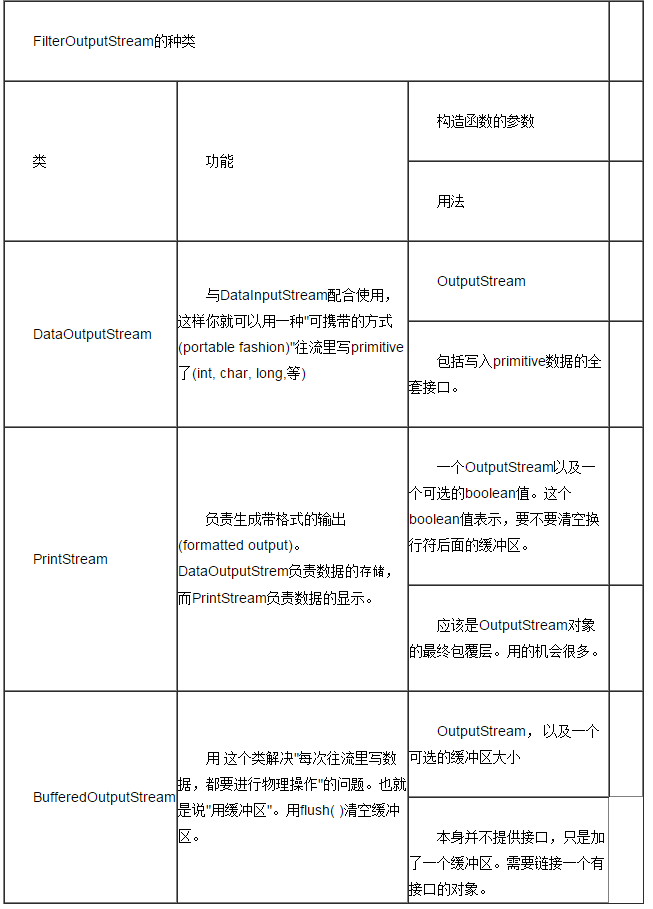
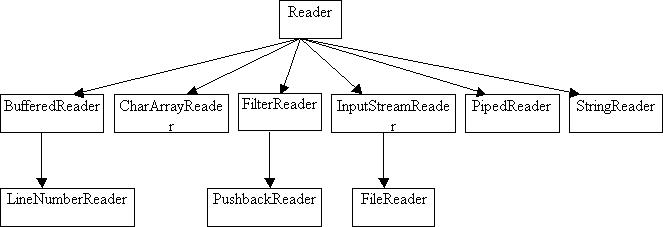
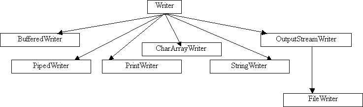
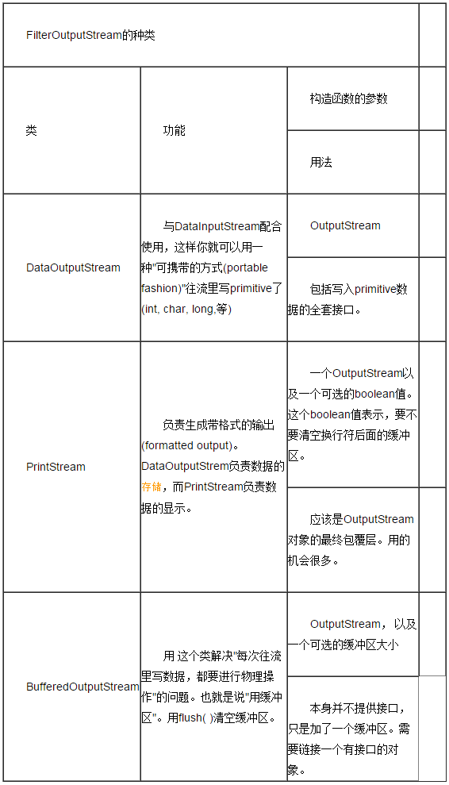

# 输入输出流

# Java 输入输出流详解

通过数据流、序列化和文件系统提供系统输入和输出。
Java 把这些不同来源和目标的数据都统一抽象为数据流。Java 语言的输入输出功能是十分强大而灵活的，美中不足的是看上去输入输出的代码并不是很简洁，因为你往往需要包装许多不同的对象。
在 Java 类库中，IO 部分的内容是很庞大的，因为它涉及的领域很广泛:标准输入输出，文件的操作，网络上的数据流，字符串流，对象流，zip 文件流。
## 1.1、Java 流的分类
按流向分:
输入流: 程序可以从中读取数据的流。
输出流: 程序能向其中写入数据的流。
按数据传输单位分:
字节流: 以字节为单位传输数据的流
字符流: 以字符为单位传输数据的流
按功能分:
节点流: 用于直接操作目标设备的流
过滤流: 是对一个已存在的流的链接和封装，通过对数据进行处理为程序提供功能强大、灵活的读写功能。
## 1.2、java.io 常用类
JDK 所提供的所有流类位于 java.io 包中，都分别继承自以下四种抽象流类：
InputStream：继承自 InputStream 的流都是用于向程序中输入数据的，且数据单位都是字节（8位）。
OutputSteam：继承自 OutputStream 的流都是程序用于向外输出数据的，且数据单位都是字节（8位）。
Reader：继承自 Reader 的流都是用于向程序中输入数据的，且数据单位都是字符（16位）。
Writer：继承自 Writer 的流都是程序用于向外输出数据的，且数据单位都是字符（16位）。

java 语言的输入输出功能是十分强大而灵活的，美中不足的是看上去输入输出的代码并不是很简洁，因为你往往需要包装许多不同的对象。在 Java 类库中，IO 部分的内容是很庞大的，因为它涉及的领域很广泛:标准输入输出，文件的操作，网络上的数据流，字符串流，对象流，zip 文件流....本文的目的是为大家做一个简要的介绍。
流是一个很形象的概念，当程序需要读取数据的时候，就会开启一个通向数据源的流，这个数据源可以是文件，内存，或是网络连接。类似的，当程序需要写入数据的时候，就会开启一个通向目的地的流。这时候你就可以想象数据好像在这其中“流”动一样，如下图：



Java 中的流分为两种，一种是字节流，另一种是字符流，分别由四个抽象类来表示（每种流包括输入和输出两种所以一共四个）:InputStream，OutputStream，Reader，Writer。Java 中其他多种多样变化的流均是由它们派生出来的:
stream 代表的是任何有能力产出数据的数据源，或是任何有能力接收数据的接收源。在 Java 的 IO 中，所有的 stream（包括 Inputstream 和 Out stream）都包括两种类型：
(1)字节流
表示以字节为单位从 stream 中读取或往 stream 中写入信息，即 io 包中的 inputstream 类和 outputstream 类的派生类。通常用来读取二进制数据，如图象和声音。
（2）字符流
以 Unicode 字符为导向的 stream，表示以 Unicode 字符为单位从 stream 中读取或往 stream 中写入信息。
区别：
Reader 和 Writer 要解决的，最主要的问题就是国际化。原先的 I/O 类库只支持8位的字节流，因此不可能很好地处理16位的 Unicode 字符流。Unicode 是国际化的字符集(更何况 Java 内置的 char 就是16位的 Unicode 字符)，这样加了 Reader 和 Writer 之后，所有的 I/O 就都支持 Unicode 了。此外新类库的性能也比旧的好。
但是，Read 和 Write 并不是取代 InputStream 和 OutputStream，有时，你还必须同时使用"基于 byte 的类"和"基于字符的类"。为此，它还提供了两个"适配器(adapter)"类。InputStreamReader 负责将 InputStream 转化成 Reader，而 OutputStreamWriter 则将 OutputStream 转化成 Writer。
一．流的层次结构
定义：
（1）java 将读取数据对象成为输入流，能向其写入的对象叫输出流。结构图如下：



输入流



输出流
 
二．InputStream 类
inputstream 类和 outputstream 类都为抽象类，不能创建对象，可以通过子类来实例化。
InputStream 是输入字节数据用的类，所以 InputStream 类提供了3种重载的 read 方法.Inputstream 类中的常用方法：
（1）public abstract int read( )：读取一个 byte 的数据，返回值是高位补0的 int 类型值。
（2）public int read(byte b[ ])：读取 b.length 个字节的数据放到b数组中。返回值是读取的字节数。该方法实际上是调用下一个方法实现的
（3）public int read(byte b[ ], int off, int len)：从输入流中最多读取 len 个字节的数据，存放到偏移量为 off 的 b 数组中。
（4）public int available( )：返回输入流中可以读取的字节数。注意：若输入阻塞，当前线程将被挂起，如果 InputStream 对象调用这个方法的话，它只会返回0，这个方法必须由继承 InputStream 类的子类对象调用才有用，
（5）public long skip(long n)：忽略输入流中的 n 个字节，返回值是实际忽略的字节数, 跳过一些字节来读取
（6）public int close( ) ：我们在使用完后，必须对我们打开的流进行关闭.
三．OutputStream 类
OutputStream 提供了3个 write 方法来做数据的输出，这个是和 InputStream 是相对应的。
1. public void write(byte b[ ])：将参数 b 中的字节写到输出流。
2. public void write(byte b[ ], int off, int len) ：将参数 b 的从偏移量 off 开始的 len 个字节写到输出流。
3. public abstract void write(int b) ：先将 int 转换为 byte 类型，把低字节写入到输出流中。
4. public void flush( ) : 将数据缓冲区中数据全部输出，并清空缓冲区。
5. public void close( ) : 关闭输出流并释放与流相关的系统资源。
注意：
1. 上述各方法都有可能引起异常。
2. InputStream 和 OutputStream 都是抽象类，不能创建这种类型的对象。
四．FileInputStream 类
FileInputStream 类是 InputStream 类的子类，用来处理以文件作为数据输入源的数据流。使用方法：
方式1：

```
File fin=new File("d:/abc.txt");
FileInputStream in=new FileInputStream(fin);
```

方式2：

```
FileInputStream in=new
FileInputStream("d: /abc.txt");
```

方式3：
构造函数将 FileDescriptor()对象作为其参数。

```
FileDescriptor() fd=new FileDescriptor();
FileInputStream f2=new FileInputStream(fd);
```

五．FileOutputStream 类
FileOutputStream 类用来处理以文件作为数据输出目的数据流；一个表示文件名的字符串，也可以是 File 或 FileDescriptor 对象。
创建一个文件流对象有两种方法：
方式1：

```
File f=new File("d:/abc.txt");
FileOutputStream out=new FileOutputStream (f);
```

方式2：

```
FileOutputStream out=new
FileOutputStream("d:/abc.txt");
```

方式3：构造函数将 FileDescriptor()对象作为其参数。

```
FileDescriptor() fd=new FileDescriptor();
FileOutputStream f2=new FileOutputStream(fd);
```

方式4：构造函数将文件名作为其第一参数，将布尔值作为第二参数。

```
FileOutputStream f=new FileOutputStream("d:/abc.txt",true);
```

注意：
（1）文件中写数据时，若文件已经存在，则覆盖存在的文件；（2）的读/写操作结束时，应调用 close 方法关闭流。
举例：2-1
六．File 类
File 类与 InputStream / OutputStream 类同属于一个包，它不允许访问文件内容。
File 类主要用于命名文件、查询文件属性和处理文件目录。
举例：2-2
七．从一个流构造另一个流
java 的流类提供了结构化方法，如，底层流和高层过滤流。
而高层流不是从输入设备读取，而是从其他流读取。同样高层输出流也不是写入输出设备，而是写入其他流。
使用"分层对象(layered objects)"，为单个对象动态地，透明地添加功能的做法，被称为 Decorator Pattern。Decorator 模式要求所有包覆在原始对象之外的对象，都必须具有与之完全相同的接口。这使得 decorator 的用法变得非常的透明--无论对象是否被 decorate 过，传给它的消息总是相同的。这也是 Java I/O 类库要有"filter(过滤器)"类的原因：抽象的"filter"类是所有 decorator 的基类。Decorator 模式常用于如下的情形：如果用继承来解决各种需求的话，类的数量会多到不切实际的地步。Java 的 I/O 类库需要提供很多功能的组合，于是 decorator 模式就有了用武之地。
为 InputStream 和 OutputStream 定义 decorator 类接口的类，分别是 FilterInputStream 和 FilterOutputStream。





DataInputStream 类对象可以读取各种类型的数据。
DataOutputStream 类对象可以写各种类型的数据；
创建这两类对象时，必须使新建立的对象指向构造函数中的参数对象。例如：

```
FileInputStream in=new FileInputStream("d:/abc.txt");
DataInputStream din=new DataInputStream(in);
```

7.2BufferInputStream 和 bufferOutputStream
允许程序在不降低系统性能的情况下一次一个字节的从流中读取数据。
BufferInputstream 定义了两种构造函数
（1）BufferInputStream b= new BufferInputstream(in);
（2）BufferInputStream b=new BufferInputStream(in,size)
第二个参数表示指定缓冲器的大小。
同样 BufferOutputStream 也有两种构造函数。一次一个字节的向流中写数据。
7.3printstream
用于写入文本或基本类型
两种构造函数方法：
PrintStream ps=new PrintStream(out);
PrintStream ps=new PrintStream(out, autoflush)
第二个参数为布尔值，控制每次输出换行符时 java 是否刷新输出流。
八．字符流的读取和写入
java.io.Reader 和 java.io.InputStream 组成了 Java 输入类。Reader 用于读入16位字符，也就是 Unicode 编码的字符；而 InputStream 用于读入 ASCII 字符和二进制数据。



Reader 体系结构
（1）FileReader
FileReader 主要用来读取字符文件，使用缺省的字符编码，有三种构造函数：
--将文件名作为字符串

```
FileReader f=new FileReader(“c:/temp.txt”);
```

--构造函数将 File 对象作为其参数。

```
File f=new file(“c:/temp.txt”);
FileReader f1=new FileReader(f);
```

--构造函数将 FileDescriptor 对象作为参数

```
FileDescriptor() fd=new FileDescriptor()
FileReader f2=new FileReader(fd);
```

(2)charArrayReader
将字符数组作为输入流,构造函数为：

```
public CharArrayReader(char[] ch);
```

(3)StringReader
读取字符串，构造函数如下：

```
public StringReader(String s);
```

(4)InputStreamReader
从输入流读取字节，在将它们转换成字符。

```
Public inputstreamReader(inputstream is);
```

(5)FilterReader
允许过滤字符流

```
protected filterReader(Reader r);
```

(6)BufferReader
接受 Reader 对象作为参数，并对其添加字符缓冲器，使用readline()方法可以读取一行。

```
Public BufferReader(Reader r);
```



Writer 类体系结构
（1）FileWrite
将字符类型数据写入文件，使用缺省字符编码和缓冲器大小。

```
Public FileWrite(file f);
```

(2)chararrayWrite()
将字符缓冲器用作输出。

```
Public CharArrayWrite();
```

(3)PrintWrite
生成格式化输出

```
public PrintWriter(outputstream os);
```

(4)filterWriter
用于写入过滤字符流

```
protected FilterWriter(Writer w);
```



DataInputStream 类对象可以读取各种类型的数据。
DataOutputStream 类对象可以写各种类型的数据；
创建这两类对象时，必须使新建立的对象指向构造函数中的参数对象。例如：

```
FileInputStream in=new FileInputStream("d:/abc.txt");
DataInputStream din=new DataInputStream(in);
```

7.2BufferInputStream 和 bufferOutputStream
允许程序在不降低系统性能的情况下一次一个字节的从流中读取数据。
BufferInputstream 定义了两种构造函数
（1）BufferInputStream b= new BufferInputstream(in);
（2）BufferInputStream b=new BufferInputStream(in,size)
第二个参数表示指定缓冲器的大小。
同样 BufferOutputStream 也有两种构造函数。一次一个字节的向流中写数据。
7.3printstream
用于写入文本或基本类型
两种构造函数方法：
PrintStream ps=new PrintStream(out);
PrintStream ps=new PrintStream(out, autoflush)
第二个参数为布尔值，控制每次输出换行符时 java 是否刷新输出流