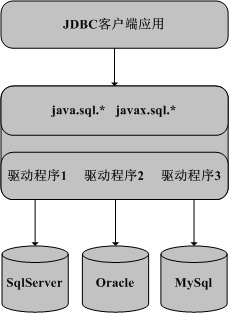
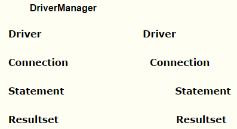
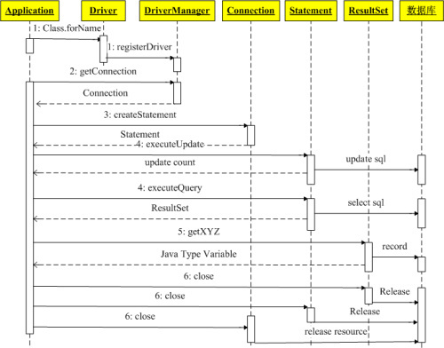

# JDBC

什么是 JDBC?
Java 语言访问数据库的一种规范,是一套 API
JDBC (Java Database Connectivity) API，即 Java 数据库编程接口，是一组标准的 Java 语言中的接口和类，使用这些接口和类，Java 客户端程序可以访问各种不同类型的数据库。比如建立数据库连接、执行 SQL 语句进行数据的存取操作。
 
JDBC 规范采用接口和实现分离的思想设计了 Java 数据库编程的框架。接口包含在 java.sql 及 javax.sql 包中，其中 java.sql 属于 JavaSE，javax.sql 属于 JavaEE。这些接口的实现类叫做数据库驱动程序，由数据库的厂商或其它的厂商或个人提供。
 
为了使客户端程序独立于特定的数据库驱动程序，JDBC 规范建议开发者使用基于接口的编程方式，即尽量使应用仅依赖 java.sql 及 javax.sql 中的接口和类。



JDBC 驱动程序:
什么是 JDBC 驱动程序?
这些是各个数据库厂家根据 JDBC 的规范制作的 JDBC 实现类
JDBC 驱动程序的四种类型:
1. 第一种类型的驱动程序的实现是通过将 JDBC 的调用全部委托给其它编程接口来实现的，比如 ODBC。这种类型的驱动程序需要安装本地代码库，即依赖于本地的程序，所以便携性较差。比如 JDBC-ODBC 桥驱动程序
2. 第二种类型的驱动程序的实现是部分基于 Java 语言的。即该驱动程序一部分是用 Java 语言编写，其它部分委托本地的数据库的客户端代码来实现。同类型1的驱动一样，该类型的驱动程序也依赖本地的程序，所以便携性较差
3. 第三种类型的驱动程序的实现是全部基于 JAVA 语言的。该类型的驱动程序通常由某个中间件服务器提供，这样客户端程序可以使用数据库无关的协议和中间件服务器进行通信，中间件服务器再将客户端的 JDBC 调用转发给数据库进行处理
4. 第四种类型的驱动程序的实现是全部基于 JAVA 语言的。该类型的驱动程序中包含了特定数据库的访问协议，使得客户端可以直接和数据库进行通信
 
JDBC 类结构:



DriverManager:这个是一个实现类,它是一个工厂类,用来生产 Driver 对象的
这个类的结构设计模式为工厂方法
Driver:这是驱动程序对象的接口,它指向一个实实在在的数据库驱动程序对象,那么这个数据库驱动程序对象是从哪里来的呢?
DriverManager 工厂中有个方法:getDriver(String URL),通过这个方法可以得到驱动程序对象,这个方法是在各个数据库厂商按JDBC规范设计的数据库驱动程序包里的类中静态实现的,也就是在静态块中
Connection:这个接口可以制向一个数据库连接对象,那么如何得到这个连接对象呢?
是通过 DriverManager 工厂中的 getConnection(String URL)方法得到的
Statement:用于执行静态的 SQL 语句的接口,通过 Connection 中的 createStatement 方法得到的
Resultset:用于指向结果集对象的接口,结果集对象是通过 Statement 中的 execute 等方法得到的
 
JAVA 使用 JDBC 访问数据库的步骤:
1. 得到数据库驱动程序
2. 创建数据库连接
3. 执行 SQL 语句
4. 得到结果集
5. 对结果集做相应的处理(增,删,改,查)
6. 关闭资源:这里释放的是 DB 中的资源



设置 classpath:
1. 在 java 文件中起的包名一定要是工程基目录下的子目录,classpath:基目录
2. .jar 包,需要将这个 .jar 包的路径包括这个文件的全名添加到 classpath 中来
Oracle 连接字符串的书写格式:
“oracle:jdbc:thin:@ip:1521: 数据库名”,”数据库用户名”,”数据库密码”
 
简单的例子:

```
package moudule1.first;
 
import java.sql.*;
 
public class FirstJdbc
{
      public static void main(String[] args)
      {
                 String sql="select * from yuchen_user";
                 Connection con=null;
                 Statement st=null;
                 ResultSet rs=null;
                
       try
       { 
                 Class.forName("oracle.jdbc.driver.OracleDriver");
                 con=DriverManager.getConnection("jdbc:oracle:thin:@127.0.0.1:1521:name", "scott","tiger");
                 st=con.createStatement();
                 rs=st.executeQuery(sql);
                 while(rs.next())
                 {
                            System.out.println(rs.getInt("id"));
                            System.out.println(rs.getString("name"));
                 }
       }catch(Exception e)
       {
                 e.printStackTrace();
       }finally
       {
                 try
                 {
                      con.close();
                 }catch(Exception e)
                 {}
                
                 try
                 {
                      st.close();
                 }catch(Exception e)
                 {
                 }
                
                 try
                 {
                      rs.close();
                 }catch(Exception e)
                 {
                 }
                     
       }
 
                
      }
     
}
``` 
 
常用数据库的驱动程序及 JDBC URL:
Oracle 数据库:
驱动程序包名：ojdbc14.jar
驱动类的名字：oracle.jdbc.driver.OracleDriver
JDBC URL：jdbc:oracle:thin:@dbip:port:databasename
说明：驱动程序包名有可能会变
JDBC URL 中黑色字体部分必须原封不动的保留，为该驱动识别的 URL 格式。红色字体部分需要根据数据库的安装情况填写。其中各个部分含义如下：
dbip –为数据库服务器的 IP 地址，如果是本地可写：localhost 或 127.0.0.1。
port –为数据库的监听端口，需要看安装时的配置，缺省为1521。
databasename –为数据库的 SID，通常为全局数据库的名字。
举例如果要访问本地的数据库 allandb，端口1521，那么 URL 写法如下：
jdbc:oracle:thin:@localhost:1521:allandb 下载地址如下:
http://www.oracle.com/technology/software/tech/java/sqlj_jdbc/index.html
 
SQL Server 数据库
驱动程序包名：msbase.jar mssqlserver.jar msutil.jar
驱动类的名字：com.microsoft.jdbc.sqlserver.SQLServerDriver
JDBC URL：jdbc:microsoft:sqlserver://dbip:port;DatabaseName=databasename
说明：驱动程序包名有可能会变
JDBC URL 中黑色字体部分必须原封不动的保留，为该驱动识别的 URL 格式。红色字体部需要根据数据库的安装情况填写。其中各个部分含义如下：
dbip –为数据库服务器的 IP 地址，如果是本地可写：localhost 或 127.0.0.1。
port –为数据库的监听端口，需要看安装时的配置，缺省为1433。
databasename –数据库的名字。
举例如果要访问本地的数据库 allandb，端口1433，那么 URL 写法如下：
jdbc: microsoft: sqlserver:@localhost:1433; DatabaseName =allandb
下载地址：http://www.microsoft.com/downloads/details.aspx
 
MySQL 数据库
驱动程序包名：mysql-connector-java-3.1.11-bin.jar
驱动类的名字：com.mysql.jdbc.Driver
JDBC URL：jdbc:mysql://dbip:port/databasename
说明：驱动程序包名有可能会变
JDBC URL 中黑色字体部分必须原封不动的保留，为该驱动识别的 URL 格式。红色字体部需要根据数据库的安装情况填写。其中各个部分含义如下：
dbip –为数据库服务器的 IP 地址，如果是本地可写：localhost 或 127.0.0.1。
port –为数据库的监听端口，需要看安装时的配置，缺省为3306。
databasename –数据库的名字。
举例如果要访问本地的数据库 allandb，端口1433，那么 URL 写法如下：
jdbc:mysql://localhost:3306/allandb
下载地址：http://dev.mysql.com/downloads/connector/j/
 
Access 数据库
驱动程序包名：该驱动程序包含在 JavaSE 中，不需要额外安装。
驱动类的名字：sun.jdbc.odbc.JdbcOdbcDriver
JDBC URL：jdbc:odbc:datasourcename
说明：该驱动只能工作在 Windows 系统中，首先需要在操作系统中建立一个可以访问Access 数据库的本地数据源(ODBC)，如果名字为 allandb，那么 URL 写法如下：
jdbc:odbc:allandb
 
PreparedStatement 接口:
预编译的 sql 语句对象
作用: 解决了书写 sql 语句时一些特殊的字符与 sql 保留字符冲突的问题,非常方便

```
/**
*知识点:
*PreparedStatement 接口及方法的使用
*程序目标:
*java文件:
*PreparedInsert.java:连接数据库,插入一条数据
*JdbcUtil.java:实现一个工具类,功能:1.连接数据库 2.关闭资源
*/ 
package moudule1.preparedstatement;
 
import java.sql.*;
import moudule1.com.*;
 
public class PreparedInsert
{
      public static void main(String[] args)
      {
           String sql="insert into yuchen_user (id,name) values (?,?)";
           System.out.println(sql);
          
           Connection con=null;
           PreparedStatement ps=null;
          
           try{
                 con=JdbcUtil.getConnection();
                 ps=con.prepareStatement(sql);
                
                 ps.setInt(1,2);
                 ps.setString(2,"zhangsan");
                 ps.executeUpdate();
                
                 ps.setInt(1,3);
                 ps.setString(2,"lisi");
                 ps.executeUpdate();
                
           }catch(Exception e){
                 e.printStackTrace();
           }finally{
                 JdbcUtil.close(con,ps);
                 }
           }
      }
 
package moudule1.com;
 
import java.sql.*;
 
public class JdbcUtil{
     
      public static Connection getConnection() throws Exception{
           Class.forName("oracle.jdbc.driver.OracleDriver");
       return DriverManager.getConnection("jdbc:oracle:thin:@127.0.0.1:1521:name", "scott","tiger");
           }
          
      public static void close(Connection con,Statement st){
          
           close(con);
           close(st);
          
           }
          
      public static void close(Connection con,Statement st,ResultSet rs){
          
          
           close(con,st);
           close(rs);
          
           }
          
      public static void close(Connection con){
           try{
                
                 con.close();
                
           }catch(Exception e){
                
                
                 }
          
           }
          
      public static void close(Statement st){
          
           try{
                
                 st.close();
                
           }catch(Exception e){
                
                 }
           }
          
      public static void close(ResultSet rs){
          
           try{
                
                 rs.close();
                
           }catch(Exception e){
                
                 }
          
           }
     
      }
     
数据库的增删改查的例子:
/**
*知识点:
*JDBC+SQL+ORACLE
*程序目标:
*UserDao.java:实现了数据库的增删改查
*JdbcUtil.java:工具类,有连库和关闭资源的方法
*/
 
package moudule1.idus;
 
import java.sql.*;
import moudule1.com.*;
 
public class UserDao{
     
      private String sql;
      private Connection con;
      private Statement st;
      private ResultSet rs;
     
      public UserDao(){
           sql=null;
           con=null;
           st=null;
           rs=null;
           }
     
      public void insert(){
          
           sql="insert into yuchen_user (id,name) values(";
           sql+="4,'zhouwu')";
           System.out.println(sql);
          
           try{
                
           con=JdbcUtil.getConnection();
           st=con.createStatement();
           st.executeUpdate(sql);
          
           }catch(Exception e){
                
                 e.printStackTrace();
                
           }finally{
                
                 JdbcUtil.close(con,st);
                
                 }
          
           }
          
          
      public void delete(){
          
           sql="delete from yuchen_user where id=2";
           System.out.println(sql);
          
           try{
                
                 con=JdbcUtil.getConnection();
            st=con.createStatement();
            st.executeUpdate(sql);
                
           }catch(Exception e){
                
                 e.printStackTrace();
                
           }finally{
                
                 JdbcUtil.close(con,st);
                
                 }
           }
          
          
      public void update(){
          
           sql="update yuchen_user set name='liumang' where id=1";
           System.out.println(sql);
          
           try{
                
                 con=JdbcUtil.getConnection();
            st=con.createStatement();
            st.executeUpdate(sql);
                
           }catch(Exception e){
                
                 e.printStackTrace();
                
           }finally{
                
                 JdbcUtil.close(con,st);
                
                 }
           }
          
          
      public void select(){
          
           sql="select * from yuchen_user";
           System.out.println(sql);
          
           try{
                
                 con=JdbcUtil.getConnection();
            st=con.createStatement();
             rs=st.executeQuery(sql);
            
            while(rs.next()){
              
               System.out.println(rs.getInt(1));
               System.out.println(rs.getString(2));
              
               }
                
           }catch(Exception e){
                
                 e.printStackTrace();
                
           }finally{
                
                 JdbcUtil.close(con,st,rs);
                
                 }
          
           }
          
          
      public static void main(String[] args){
          
           UserDao ud=new UserDao();
           ud.select();
           ud.insert();
           ud.select();
           ud.update();
           ud.select();
           ud.delete();
           ud.select();
           }
      }
 
一些常用的方法:
/**
*知识点:
*execute方法,getResultSet(),getUpdateCount()
*程序目标:
*JdbcUtil.java:工具类,连接数据库,关闭资源
*sqlExecutor.java:命令行参数输入sql语句,并执行该语句
*/
package moudule1.fangfa;
 
import java.sql.*;
import moudule1.com.*;
 
public class sqlExecutor{
     
      public static void main(String[] args){
          
           Connection con=null;
           Statement st=null;
          
           try{
                
                 con=JdbcUtil.getConnection();
                 st=con.createStatement();
                 boolean str=st.execute(args[0]);
                
                 if(str){
 
                      ResultSet rs=st.getResultSet();
                     
                      while(rs.next()){
                            System.out.println(rs.getInt("id")+":"+rs.getString("name"));
                            }
                           
                            rs.close();
                     
                 }else{
                      int row=st.getUpdateCount();
                      System.out.println(row);
                      }
                
           }catch(Exception e){
                
                 e.printStackTrace();
                
           }finally{
                
                 JdbcUtil.close(con,st);
                
                 }
           }
      }
```