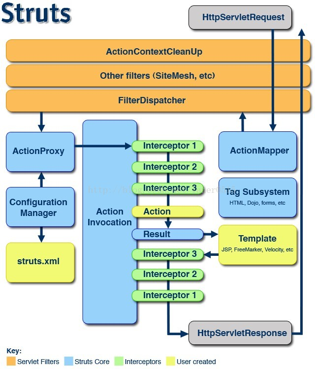

# Struts2

# Struts2 的核心和工作原理

在学习 struts2 之前，首先我们要明白使用 struts2 的目的是什么？它能给我们带来什么样的好处？

**设计目标**

Struts 设计的第一目标就是使 MVC 模式应用于 web 程序设计。在这儿 MVC 模式的好处就不在提了。

**技术优势**
Struts2 有两方面的技术优势，一是所有的 Struts2 应用程序都是基于 client/server HTTP交换协议，The Java Servlet API 揭示了 Java Servlet 只是 Java API 的一个很小子集，这样我们可以在业务逻辑部分使用功能强大的 Java 语言进行程序设计。
    
二是提供了对 MVC 的一个清晰的实现，这一实现包含了很多参与对所以请求进行处理的关键组件，如：拦截器、OGNL 表达式语言、堆栈。

因为 struts2 有这样目标，并且有这样的优势，所以，这是我们学习 struts2 的理由，下面，我们在深入剖析一下 struts 的工作原理。

**工作原理**
Suruts2 的工作原理可以用下面这张图来描述，下面我们分步骤介绍一下每一步的核心内容



一个请求在 Struts2 框架中的处理大概分为以下几个步骤 

1、客户端初始化一个指向 Servlet 容器（例如 Tomcat）的请求

2、这个请求经过一系列的过滤器（Filter）（这些过滤器中有一个叫做 ActionContextCleanUp的可选过滤器，这个过滤器对于 Struts2 和其他框架的集成很有帮助，例如：SiteMesh Plugin）
 
3、接着 FilterDispatcher 被调用，FilterDispatcher 询问 ActionMapper 来决定这个请是否需要调用某个 Action,FilterDispatcher 是控制器的核心，就是 mvc 中 c 控制层的核心。下面粗略的分析下我理解的 FilterDispatcher 工作流程和原理：FilterDispatcher 进行初始化并启用核心 doFilter

```
public void doFilter(ServletRequest req, ServletResponse res, FilterChain chain) throws IOException, ServletException ...{
        HttpServletRequest request = (HttpServletRequest) req;
        HttpServletResponse response = (HttpServletResponse) res;
        ServletContext servletContext = filterConfig.getServletContext();
        // 在这里处理了HttpServletRequest和HttpServletResponse。
        DispatcherUtils du = DispatcherUtils.getInstance();
        du.prepare(request, response);//正如这个方法名字一样进行locale、encoding以及特殊request parameters设置
        try ...{
            request = du.wrapRequest(request, servletContext);//对request进行包装
        } catch (IOException e) ...{
            String message = "Could not wrap servlet request with MultipartRequestWrapper!";
            LOG.error(message, e);
            throw new ServletException(message, e);
        }
                ActionMapperIF mapper = ActionMapperFactory.getMapper();//得到action的mapper
        ActionMapping mapping = mapper.getMapping(request);// 得到action 的 mapping
        if (mapping == null) ...{
            // there is no action in this request, should we look for a static resource?
            String resourcePath = RequestUtils.getServletPath(request);
            if ("".equals(resourcePath) && null != request.getPathInfo()) ...{
                resourcePath = request.getPathInfo();
            }
            if ("true".equals(Configuration.get(WebWorkConstants.WEBWORK_SERVE_STATIC_CONTENT)) 
                    && resourcePath.startsWith("/webwork")) ...{
                String name = resourcePath.substring("/webwork".length());
                findStaticResource(name, response);
            } else ...{
                // this is a normal request, let it pass through
                chain.doFilter(request, response);
            }
            // WW did its job here
            return;
        }
        Object o = null;
        try ...{
            //setupContainer(request);
            o = beforeActionInvocation(request, servletContext);
//整个框架最最核心的方法，下面分析
            du.serviceAction(request, response, servletContext, mapping);
        } finally ...{
            afterActionInvocation(request, servletContext, o);
            ActionContext.setContext(null);
        }
    }
du.serviceAction(request, response, servletContext, mapping);
//这个方法询问ActionMapper是否需要调用某个Action来处理这个（request）请求，如果ActionMapper决定需要调用某个Action，FilterDispatcher把请求的处理交给ActionProxy
 
public void serviceAction(HttpServletRequest request, HttpServletResponse response, String namespace, String actionName, Map requestMap, Map parameterMap, Map sessionMap, Map applicationMap) ...{ 
        HashMap extraContext = createContextMap(requestMap, parameterMap, sessionMap, applicationMap, request, response, getServletConfig());  //实例化Map请求 ，询问ActionMapper是否需要调用某个Action来处理这个（request）请求
        extraContext.put(SERVLET_DISPATCHER, this); 
        OgnlValueStack stack = (OgnlValueStack) request.getAttribute(ServletActionContext.WEBWORK_VALUESTACK_KEY); 
        if (stack != null) ...{ 
            extraContext.put(ActionContext.VALUE_STACK,new OgnlValueStack(stack)); 
        } 
        try ...{ 
            ActionProxy proxy = ActionProxyFactory.getFactory().createActionProxy(namespace, actionName, extraContext); 
//这里actionName是通过两道getActionName解析出来的, FilterDispatcher把请求的处理交给ActionProxy，下面是ServletDispatcher的 TODO: 
            request.setAttribute(ServletActionContext.WEBWORK_VALUESTACK_KEY, proxy.getInvocation().getStack()); 
            proxy.execute(); 
         //通过代理模式执行ActionProxy
            if (stack != null)...{ 
                request.setAttribute(ServletActionContext.WEBWORK_VALUESTACK_KEY,stack); 
            } 
        } catch (ConfigurationException e) ...{ 
            log.error("Could not find action", e); 
            sendError(request, response, HttpServletResponse.SC_NOT_FOUND, e); 
        } catch (Exception e) ...{ 
            log.error("Could not execute action", e); 
            sendError(request, response, HttpServletResponse.SC_INTERNAL_SERVER_ERROR, e); 
        } 
} 
```

4、如果 ActionMapper 决定需要调用某个 Action，FilterDispatcher 把请求的处理交给 ActionProxy 

5、ActionProxy 通过 ConfigurationManager 询问框架的配置文件，找到需要调用的 Action 类 ,这里，我们一般是从 struts.xml 配置中读取。

6、ActionProxy 创建一个 ActionInvocation 的实例。

7、ActionInvocation 实例使用命名模式来调用，在调用 Action 的过程前后，涉及到相关拦截器（Intercepter）的调用。

下面我们来看看 ActionInvocation 是如何工作的：

ActionInvocation 是 Xworks 中 Action 调度的核心。而对 Interceptor 的调度，也正是由 ActionInvocation 负责。ActionInvocation 是一个接口，而 DefaultActionInvocation 则是 Webwork 对 ActionInvocation 的默认实现。
    
Interceptor 的调度流程大致如下：
    
1. ActionInvocation 初始化时，根据配置，加载 Action 相关的所有 Interceptor。
    
2. 通过 ActionInvocation.invoke 方法调用 Action 实现时，执行 Interceptor。
   
Interceptor 将很多功能从我们的 Action 中独立出来，大量减少了我们 Action 的代码，独立出来的行为具有很好的重用性。XWork、WebWork 的许多功能都是有 Interceptor 实现，可以在配置文件中组装 Action 用到的 Interceptor，它会按照你指定的顺序，在 Action 执行前后运行。
    
这里，我们简单的介绍一下 Interceptor
    
在 struts2 中自带了很多拦截器，在 struts2-core-2.1.6.jar 这个包下的 struts-default.xml 中我们可以发现：

```
<interceptors>
           <interceptor name="alias"class="com.opensymphony.xwork2.interceptor.AliasInterceptor"/>
           <interceptor name="autowiring"class="com.opensymphony.xwork2.spring.interceptor.ActionAutowiringInterceptor"/>
           <interceptor name="chain"class="com.opensymphony.xwork2.interceptor.ChainingInterceptor"/>
           <interceptor name="conversionError"class="org.apache.struts2.interceptor.StrutsConversionErrorInterceptor"/>
           <interceptor name="clearSession"class="org.apache.struts2.interceptor.ClearSessionInterceptor"/>
           <interceptor name="createSession"class="org.apache.struts2.interceptor.CreateSessionInterceptor"/>
           <interceptor name="debugging"class="org.apache.struts2.interceptor.debugging.DebuggingInterceptor"/>
           <interceptor name="externalRef"class="com.opensymphony.xwork2.interceptor.ExternalReferencesInterceptor"/>
           <interceptor name="execAndWait"class="org.apache.struts2.interceptor.ExecuteAndWaitInterceptor"/>
           <interceptor name="exception"class="com.opensymphony.xwork2.interceptor.ExceptionMappingInterceptor"/>
           <interceptor name="fileUpload"class="org.apache.struts2.interceptor.FileUploadInterceptor"/>
           <interceptor name="i18n"class="com.opensymphony.xwork2.interceptor.I18nInterceptor"/>
           <interceptor name="logger"class="com.opensymphony.xwork2.interceptor.LoggingInterceptor"/>
           <interceptor name="modelDriven"class="com.opensymphony.xwork2.interceptor.ModelDrivenInterceptor"/>
           <interceptor name="scopedModelDriven"class="com.opensymphony.xwork2.interceptor.ScopedModelDrivenInterceptor"/>
           <interceptor name="params"class="com.opensymphony.xwork2.interceptor.ParametersInterceptor"/>
           <interceptor name="actionMappingParams"class="org.apache.struts2.interceptor.ActionMappingParametersInteceptor"/>
           <interceptor name="prepare"class="com.opensymphony.xwork2.interceptor.PrepareInterceptor"/>
           <interceptor name="staticParams"class="com.opensymphony.xwork2.interceptor.StaticParametersInterceptor"/>
           <interceptor name="scope"class="org.apache.struts2.interceptor.ScopeInterceptor"/>
           <interceptor name="servletConfig"class="org.apache.struts2.interceptor.ServletConfigInterceptor"/>
           <interceptor name="sessionAutowiring"class="org.apache.struts2.spring.interceptor.SessionContextAutowiringInterceptor"/>
           <interceptor name="timer"class="com.opensymphony.xwork2.interceptor.TimerInterceptor"/>
           <interceptor name="token"class="org.apache.struts2.interceptor.TokenInterceptor"/>
           <interceptor name="tokenSession"class="org.apache.struts2.interceptor.TokenSessionStoreInterceptor"/>
           <interceptor name="validation"class="org.apache.struts2.interceptor.validation.AnnotationValidationInterceptor"/>
           <interceptor name="workflow"class="com.opensymphony.xwork2.interceptor.DefaultWorkflowInterceptor"/>
           <interceptor name="store"class="org.apache.struts2.interceptor.MessageStoreInterceptor"/>
           <interceptor name="checkbox"class="org.apache.struts2.interceptor.CheckboxInterceptor"/>
           <interceptor name="profiling"class="org.apache.struts2.interceptor.ProfilingActivationInterceptor"/>
           <interceptor name="roles"class="org.apache.struts2.interceptor.RolesInterceptor"/>
           <interceptor name="jsonValidation"class="org.apache.struts2.interceptor.validation.JSONValidationInterceptor"/>
           <interceptorname="annotationWorkflow"class="com.opensymphony.xwork2.interceptor.annotations.AnnotationWorkflowInterceptor"/>
```

对于 sturts2 自带的拦截器，使用起来就相对比较方便了，我们只需要在 struts.xml 的 action 标签中加入 <interceptor-ref name=" logger " /> 并且 struts.xml 扩展 struts-default，就可以使用

如果是要自定义拦截器，首先需要写一个拦截器的类：

```
package ceshi;
import com.opensymphony.xwork2.ActionInvocation;
import com.opensymphony.xwork2.interceptor.AbstractInterceptor;
 
publicclassAuthorizationInterceptor extends AbstractInterceptor {
 
    @Override
    public Stringintercept(ActionInvocation ai)throws Exception {
       
           System.out.println("abc");
            return ai.invoke();
           
    }
 
}
```

并且在 struts.xml 中进行配置

```
<!DOCTYPEstruts PUBLIC
"-//Apache SoftwareFoundation//DTD Struts Configuration 2.0//EN"
"http://struts.apache.org/dtds/struts-2.0.dtd">
 
 
<struts>
    <package name="test"extends="struts-default">
     <interceptors>
      <interceptor name="abc"class ="ceshi.AuthorizationInterceptor"/>
    </interceptors>
        <action name="TestLogger"class="vaannila.TestLoggerAction">
           <interceptor-refname="abc"/>
           <result name="success">/success.jsp</result>
           </action>
    </package>
</struts>
```

8、一旦 Action 执行完毕，ActionInvocation 负责根据 struts.xml 中的配置找到对应的返回结果。返回结果通常是（但不总是，也可能是另外的一个 Action 链）一个需要被表示的 JSP 或者 FreeMarker 的模版。在表示的过程中可以使用 Struts2 框架中继承的标签。在这个过程中需要涉及到 ActionMapper

在上述过程中所有的对象（Action，Results，Interceptors，等）都是通过 ObjectFactory 来创建的。
 
**Struts2 和 struts1 的比较**

struts2 相对于 struts1 来说简单了很多，并且功能强大了很多，我们可以从几个方面来看：

**从体系结构来看：**struts2 大量使用拦截器来出来请求，从而允许与业务逻辑控制器 与 servlet-api 分离，避免了侵入性；而 struts1.x 在 action 中明显的侵入了 servlet-api.

**从线程安全分析：**struts2.x 是线程安全的，每一个对象产生一个实例，避免了线程安全问题；而 struts1.x 在 action 中属于单线程。

**性能方面：**struts2.x 测试可以脱离 web 容器，而 struts1.x 依赖 servlet-api，测试需要依赖 web 容器。

**请求参数封装对比：**struts2.x 使用 ModelDriven 模式，这样我们直接封装 model 对象，无需要继承任何 struts2 的基类，避免了侵入性。

**标签的优势：**标签库几乎可以完全替代 JSTL 的标签库，并且 struts2.x 支持强大的 ognl 表达式。

当然，struts2 和 struts1 相比，在文件上传，数据校验等方面也 方便了好多。在这就不详谈了。
    
一个比较优秀的框架可以帮着我们更高效，稳定的开发合格的产品，不过我们也不要依赖框架，我们只要理解了思想，设计模式，我们可以自己扩展功能，不然 就要 永远让别人牵着走了！