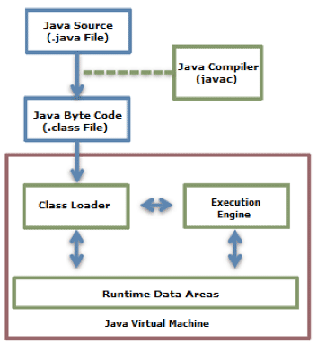
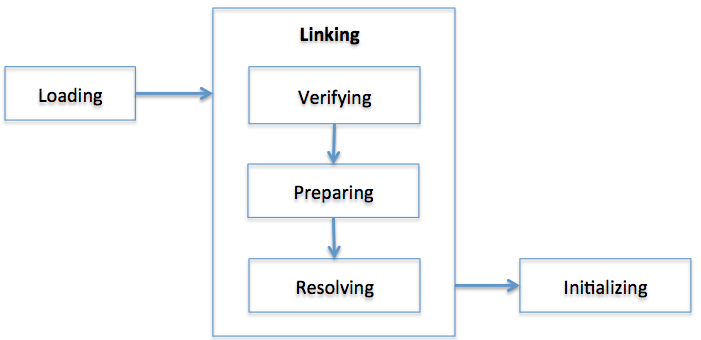

# Java 虚拟机

# Java 虚拟机工作原理详解

一、类加载器
首先来看一下 java 程序的执行过程。



从这个框图很容易大体上了解 java 程序工作原理。首先，你写好 java 代码，保存到硬盘当中。然后你在命令行中输入

```
javac YourClassName.java
```

此时，你的 java 代码就被编译成字节码（.class).如果你是在 Eclipse IDE 或者其他开发工具中，你保存代码的时候，开发工具已经帮你完成了上述的编译工作，因此你可以在对应的目录下看到 class 文件。此时的 class 文件依然是保存在硬盘中，因此，当你在命令行中运行

```
java YourClassName
```

就完成了上面红色方框中的工作。JRE 的来加载器从硬盘中读取 class 文件，载入到系统分配给 JVM 的内存区域--运行数据区（Runtime Data Areas). 然后执行引擎解释或者编译类文件，转化成特定 CPU 的机器码，CPU 执行机器码，至此完成整个过程。

接下来就重点研究一下类加载器究竟为何物？又是如何工作的？
首先看一下来加载器的一些特点，有点抽象，不过总有帮助的。

》》层级结构
类加载器被组织成一种层级结构关系，也就是父子关系。其中，Bootstrap 是所有类加载器的父亲。如下图所示：


--Bootstrap class loader：
当运行 java 虚拟机时，这个类加载器被创建，它加载一些基本的 java API，包括 Object 这个类。需要注意的是，这个类加载器不是用 java 语言写的，而是用 C/C++ 写的。
--Extension class loader:
这个加载器加载出了基本 API 之外的一些拓展类，包括一些与安全性能相关的类。（目前了解得不是很深，只能笼统说，待日后再详细说明）
--System Class Loader:
它加载应用程序中的类，也就是在你的 classpath 中配置的类。
--User-Defined Class Loader:
这是开发人员通过拓展 ClassLoader 类定义的自定义加载器，加载程序员定义的一些类。

》》委派模式（Delegation Mode）
仔细看上面的层次结构，当 JVM 加载一个类的时候，下层的加载器会将将任务委托给上一层类加载器，上一层加载检查它的命名空间中是否已经加载这个类，如果已经加载，直接使用这个类。如果没有加载，继续往上委托直到顶部。检查完了之后，按照相反的顺序进行加载，如果 Bootstrap 加载器找不到这个类，则往下委托，直到找到类文件。对于某个特定的类加载器来说，一个 Java 类只能被载入一次，也就是说在 Java 虚拟机中，类的完整标识是（classLoader，package，className）。一个雷可以被不同的类加载器加载。


举个具体的例子来说明，现在加入我有一个自己定义的类 MyClass 需要加载，如果不指定的话，一般交 App（System）加载。接到任务后，System 检查自己的库里是否已经有这个类，发现没有之后委托给 Extension，Extension 进行同样的检查，发现还是没有继续往上委托，最顶层的 Boots 发现自己库里也没有，于是根据它的路径（Java 核心类库，如 java.lang）尝试去加载，没找到这个 MaClass 类，于是只好（人家看好你，交给你完成，你无能为力，只好交给别人啦）往下委托给 Extension，Extension 到自己的路径（JAVA_HOME/jre/lib/ext)是找，还是没找到，继续往下，此时 System 加载器到 classpath 路径寻找，找到了，于是加载到 Java 虚拟机。
现在假设我们将这个类放到 JAVA_HOME/jre/lib/ext 这个路径中去（相当于交给 Extension 加载器加载），按照同样的规则，最后由 Extension 加载器加载 MyClass 类，看到了吧，统一各类被两次加载到 JVM，但是每次都是由不同的 ClassLoader 完成。

》》可见性限制
下层的加载器能够看到上层加载器中的类，反之则不行，也就是是说委托只能从下到上。

》》不允许卸载类
类加载器可以加载一个类，但是它不能卸载一个类。但是类加载器可以被删除或者被创建。

当类加载完毕之后，JVM 继续按照下图完成其他工作：



框图中各个步骤简单介绍如下：
Loading：文章前面介绍的类加载，将文件系统中的 Class 文件载入到 JVM 内存（运行数据区域）
Verifying：检查载入的类文件是否符合 Java 规范和虚拟机规范。
Preparing：为这个类分配所需要的内存，确定这个类的属性、方法等所需的数据结构。（Prepare a data structure that assigns the memory required by classes and indicates the fields, methods, and interfaces defined in the class.）
Resolving：将该类常量池中的符号引用都改变为直接引用。（不是很理解）
Initialing：初始化类的局部变量，为静态域赋值，同时执行静态初始化块。

那么，Class Loader 在加载类的时候，究竟做了些什么工作呢？
要了解这其中的细节，必须得先详细介绍一下运行数据区域。

二、运行数据区域
Runtime Data Areas：当运行一个 JVM 示例时，系统将分配给它一块内存区域（这块内存区域的大小可以设置的），这一内存区域由 JVM 自己来管理。从这一块内存中分出一块用来存储一些运行数据，例如创建的对象，传递给方法的参数，局部变量，返回值等等。分出来的这一块就称为运行数据区域。运行数据区域可以划分为6大块：Java 栈、程序计数寄存器（PC 寄存器）、本地方法栈（Native Method Stack）、Java 堆、方法区域、运行常量池（Runtime Constant Pool）。运行常量池本应该属于方法区，但是由于其重要性，JVM 规范将其独立出来说明。其中，前面3各区域（PC 寄存器、Java 栈、本地方法栈）是每个线程独自拥有的，后三者则是整个 JVM 实例中的所有线程共有的。这六大块如下图所示：


》PC 计数器：
每一个线程都拥有一个 PC 计数器，当线程启动（start）时，PC 计数器被创建，这个计数器存放当前正在被执行的字节码指令（JVM 指令）的地址。
》Java 栈：
同样的，Java 栈也是每个线程单独拥有，线程启动时创建。这个栈中存放着一系列的栈帧（Stack Frame），JVM 只能进行压入（Push）和弹出（Pop）栈帧这两种操作。每当调用一个方法时，JVM 就往栈里压入一个栈帧，方法结束返回时弹出栈帧。如果方法执行时出现异常，可以调用 printStackTrace 等方法来查看栈的情况。栈的示意图如下：


OK。现在我们再来详细看看每一个栈帧中都放着什么东西。从示意图很容易看出，每个栈帧包含三个部分：本地变量数组，操作数栈，方法所属类的常量池引用。
》局部（本地）变量数组：
局部（本地）变量数组中，从0开始按顺序存放方法所属对象的引用、传递给方法的参数、局部变量。举个例子：

```
public void doSomething(int a, double b, Object o) {
...
}
```

这个方法的栈帧中的局部变量存储的内容分别是：

```
0: this
1: a
2,3:b
4:0
```

看仔细了，其中 double 类型的 b 需要两个连续的索引。取值的时候，取出的是2这个索引中的值。如果是静态方法，则数组第0个不存放 this 引用，而是直接存储传递的参数。
》操作数栈：
操作数栈中存放方法执行时的一些中间变量，JVM 在执行方法时压入或者弹出这些变量。其实，操作数栈是方法真正工作的地方，执行方法时，局部变量数组与操作数栈根据方法定义进行数据交换。例如，执行以下代码时，操作数栈的情况如下：

```
int a = 90;
int b = 10;
int c = a + b;
```


注意在这个图中，操作数栈的地步是在上边，所以先压入的100位于上方。可以看出，操作数栈其实是一个数据临时存储区，存放一些中间变量，方法结束了，操作数栈也就没有啦。
》栈帧中数据引用：
除了局部变量数组和操作数栈之外，栈帧还需要一个常量池的引用。当 JVM 执行到需要常量池的数据时，就是通过这个引用来访问常量池的。栈帧中的数据还要负责处理方法的返回和异常。如果通过 return 返回，则将该方法的栈帧从 Java 栈中弹出。如果方法有返回值，则将返回值压入到调用该方法的方法的操作数栈中。另外，数据区中还保存中该方法可能的异常表的引用。下面的例子用来说明：

```
class Example3C{
    public static void addAndPrint(){
        double result = addTwoTypes(1,88.88);
        System.out.println(result);
    }
    public static double addTwoTypes(int i, double d){
    return i+d;
    }

}
```

执行上述代码时，Java 栈如下图所示：


花些时间好好研究上图。一样需要注意的是，栈的底部在上方，先押人员 addAndPrint 方法的栈帧，再压入 addTwoTypes 方法的栈帧。上图最右边的文字说明有错误，应该是 addTwoTypes 的执行结果存放在 addAndPrint 的操作数栈中。
》》本地方法栈
当程序通过 JNI（Java Native Interface）调用本地方法（如 C 或者 C++ 代码）时，就根据本地方法的语言类型建立相应的栈。
》》方法区域
方法区域是一个 JVM 实例中的所有线程共享的，当启动一个 JVM 实例时，方法区域被创建。它用于存运行放常量池、有关域和方法的信息、静态变量、类和方法的字节码。不同的 JVM 实现方式在实现方法区域的时候会有所区别。Oracle 的 HotSpot 称之为永久区域（Permanent Area）或者永久代（Permanent Generation）。
》》运行常量池
这个区域存放类和接口的常量，除此之外，它还存放方法和域的所有引用。当一个方法或者域被引用的时候，JVM 就通过运行常量池中的这些引用来查找方法和域在内存中的的实际地址。
》》堆（Heap）
堆中存放的是程序创建的对象或者实例。这个区域对 JVM 的性能影响很大。垃圾回收机制处理的正是这一块内存区域。
所以，类加载器加载其实就是根据编译后的 Class 文件，将 java 字节码载入 JVM 内存，并完成对运行数据处于的初始化工作，供执行引擎执行。

三、 执行引擎（Execution  Engine）
类加载器将字节码载入内存之后，执行引擎以 Java 字节码指令为但愿，读取 Java 字节码。问题是，现在的 java 字节码机器是读不懂的，因此还必须想办法将字节码转化成平台相关的机器码。这个过程可以由解释器来执行，也可以有即时编译器（JIT Compiler）来完成。

