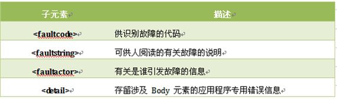
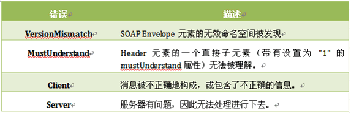
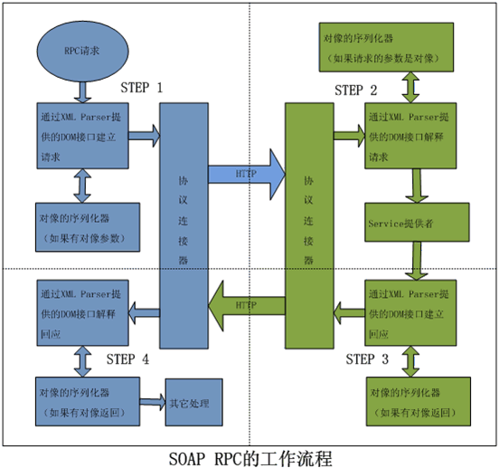
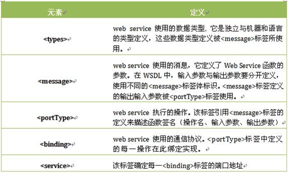

# Webservice

# Web Service 学习笔记

## Web Service 概述 

### Web Service 的定义 

W3C 组织对其的定义如下，它是一个软件系统，为了支持跨网络的机器间相互操作交互而设计。Web Service 服务通常被定义为一组模块化的 API，它们可以通过网络进行调用，来执行远程系统的请求服务。 

这里我们从一个程序员的视角来观察 web service。在传统的程序编码中，存在这各种的函数方法调用。通常，我们知道一个程序模块M中的方法 A，向其发出调用请求，并传入 A 方法需要的参数 P，方法 A 执行完毕后，返回处理结果 R。这种函数或方法调用通常发生在同一台机器上的同一程序语言环境下。现在的我们需要一种能够在不同计算机间的不同语言编写的应用程序系统中，通过网络通讯实现函数和方法调用的能力，而 Web service 正是应这种需求而诞生的。 

最普遍的一种说法就是，Web Service = SOAP + HTTP + WSDL。其中，SOAP Simple Object Access Protocol）协议是 web service 的主体，它通过 HTTP 或者 SMTP 等应用层协议进行通讯，自身使用 XML 文件来描述程序的函数方法和参数信息，从而完成不同主机的异构系统间的计算服务处理。这里的 WSDL（Web Services Description Language）web 服务描述语言也是一个 XML 文档，它通过 HTTP 向公众发布，公告客户端程序关于某个具体的 Web service 服务的 URL 信息、方法的命名，参数，返回值等。 
下面，我们先来熟悉一下 SOAP 协议，看看它是如何描述程序中的函数方法、参数及结果对象的。 

## SOAP 协议简介 

### 什么是 SOAP

SOAP 指简单对象访问协议，它是一种基于 XML 的消息通讯格式，用于网络上，不同平台，不同语言的应用程序间的通讯。可自定义，易于扩展。一条 SOAP 消息就是一个普通的 XML 文档，包含下列元素： 
- Envelope 元素，标识 XML 文档一条 SOAP 消息 
- Header 元素，包含头部信息的 XML 标签 
- Body 元素，包含所有的调用和响应的主体信息的标签 
- Fault 元素，错误信息标签。 

以上的元素都在 SOAP 的命名空间 http://www.w3.org/2001/12/soap-envelope 中声明；
 
SOAP 的语法规则 

- SOAP 消息必须用 XML 来编码 
- SOAP 消息必须使用 SOAP Envelope 命名空间 
- SOAP 消息必须使用 SOAP Encoding 命名空间 
- SOAP 消息不能包含 DTD 引用 
- SOAP 消息不能包含 XML 处理指令 

SOAP 消息的基本结构 

```
<? xml version="1.0"?>
<soap:Envelope
xmlns:soap="http://www.w3.org/2001/12/soap-envelope"
soap:encodingStyle="http://www.w3.org/2001/12/soap-encoding">
<soap:Header>
  ...
  ...
</soap:Header>
<soap:Body>
  ...
  ...
  <soap:Fault>
    ...
    ...
  </soap:Fault>
</soap:Body>
</soap:Envelope>
```

### SOAP Envelope 元素

Envelope 元素是 SOAP 消息的根元素。它指明 XML 文档是一个 SOAP 消息。它的属性 xmlns:soap 的值必须是 http://www.w3.org/2001/12/soap-envelope。 

encodingStyle 属性，语法：soap:encodingStyle="URI" 

encodingStyle 属性用于定义文档中使用的数据类型。此属性可出现在任何 SOAP 元素中，并会被应用到元素的内容及元素的所有子元素上。 

```
<? xml version="1.0"?>
<soap:Envelope
xmlns:soap="http://www.w3.org/2001/12/soap-envelope"
soap:encodingStyle="http://www.w3.org/2001/12/soap-encoding">
  ...
  Message information goes here
  ...
</soap:Envelope>
```

### SOAP Header 元素 

- actor 属性，语法 soap:actor="URI"

通过沿着消息路径经过不同的端点，SOAP 消息可从某个发送者传播到某个接收者。并非 SOAP 消息的所有部分均打算传送到 SOAP 消息的最终端点，不过，另一个方面，也许打算传送给消息路径上的一个或多个端点。SOAP 的 actor 属性可被用于将 Header 元素寻址到一个特定的端点。 

- mustUnderstand 属性 ，语法 soap:mustUnderstand="0|1"

SOAP 的 mustUnderstand 属性可用于标识标题项对于要对其进行处理的接收者来说是强制的还是可选的。假如您向 Header 元素的某个子元素添加了 "mustUnderstand="1"，则要求处理此头部的接收者必须认可此元素。

```
<? xml version="1.0"?>
<soap:Envelope
xmlns:soap="http://www.w3.org/2001/12/soap-envelope"
soap:encodingStyle="http://www.w3.org/2001/12/soap-encoding">
<soap:Header>
<m:Trans
xmlns:m="http://www.jsoso.net/transaction/" 
soap:mustUnderstand="1" 
soap:actor="http://www.w3schools.com/appml/ “  >234</m:Trans>
</soap:Header>
...
...
</soap:Envelope>
```

### SOAP Body 元素

必需的 SOAP Body 元素可包含打算传送到消息最终端点的实际 SOAP 消息。Body 元素中既可以包含 SOAP 定义的命名空间中的元素，如 Fault，也可以是用户的应用程序自定义的元素。以下是一个用户定义的请求：

```
<? xml version="1.0"?>
<soap:Envelope
xmlns:soap="http://www.w3.org/2001/12/soap-envelope"
soap:encodingStyle="http://www.w3.org/2001/12/soap-encoding">
<soap:Body>
   <m:GetPrice xmlns:m="http://www.jsoso.net/prices">
      <m:Item>Apples</m:Item>
   </m:GetPrice>
</soap:Body>
</soap:Envelope>
```

上面的例子请求苹果的价格。请注意，上面的 m:GetPrice 和 Item 元素是应用程序专用的元素。它们并不是 SOAP 标准的一部分。而对应的 SOAP 响应应该类似这样： 

```
<?xml version="1.0"?>
<soap:Envelope
xmlns:soap="http://www.w3.org/2001/12/soap-envelope"
soap:encodingStyle="http://www.w3.org/2001/12/soap-encoding">
<soap:Body>
   <m:GetPriceResponse xmlns:m="http://www.jsoso.net/prices">
      <m:Price>1.90</m:Price>
   </m:GetPriceResponse>
</soap:Body>
</soap:Envelope>
```

### SOAP Fault 元素 

Fault 元素表示 SOAP 的错误消息。它必须是 Body 元素的子元素，且在一条 SOAP 消息中，Fault 元素只能出现一次。Fault 元素拥有下列子元素：  



常用的 SOAP Fault Codes 



### HTTP 协议中的 SOAP 实例 

下面的例子中，一个 GetStockPrice 请求被发送到了服务器。此请求有一个 StockName 参数，而在响应中则会返回一个 Price 参数。此功能的命名空间被定义在此地址中： "http://www.jsoso.net/stock" 

- SOAP 请求：(注意 HTTP 的 Head 属性)

```
POST /InStock HTTP/1.1
Host: www.jsoso.net
Content-Type: application/soap+xml; charset=utf-8
Content-Length: XXX

<? xml version="1.0"?>
<soap:Envelope
xmlns:soap="http://www.w3.org/2001/12/soap-envelope"
soap:encodingStyle="http://www.w3.org/2001/12/soap-encoding">
  <soap:Body xmlns:m="http://www.jsoso.net/stock">
    <m:GetStockPrice>
      <m:StockName>IBM</m:StockName>
    </m:GetStockPrice>
  </soap:Body>  
</soap:Envelope>
```

- SOAP 响应：(注意 HTTP 的 Head 属性)

```
HTTP/1.1 200 OK
Content-Type: application/soap+xml; charset=utf-8
Content-Length: XXX

<? xml version="1.0"?>
<soap:Envelope
xmlns:soap="http://www.w3.org/2001/12/soap-envelope"
soap:encodingStyle="http://www.w3.org/2001/12/soap-encoding">
  <soap:Body xmlns:m="http://www.jsoso.net/stock">
    <m:GetStockPriceResponse>
      <m:Price>34.5</m:Price>
    </m:GetStockPriceResponse>
  </soap:Body>  
</soap:Envelope>
```

### HTTP 协议中的 SOAP RPC 工作流程

 

## WSDL 简介 

介绍过了 SOAP，让我们关注 Web Service 中另外一个重要的组成 WSDL。 

### WSDL 的主要文档元素 



WSDL 文档可以分为两部分。顶部分由抽象定义组成，而底部分则由具体描述组成。抽象部分以独立于平台和语言的方式定义SOAP消息，它们并不包含任何随机器或语言而变的元素。这就定义了一系列服务，截然不同的应用都可以实现。具体部分，如数据的序列化则归入底部分，因为它包含具体的定义。在上述的文档元素中，<types>、<message>、<portType>属于抽象定义层，<binding>、<service>属于具体定义层。所有的抽象可以是单独存在于别的文件中，也可以从主文档中导入。 

### WSDL 文档的结构实例解析
 
下面我们将通过一个实际的 WSDL 文档例子来详细说明各标签的作用及关系。

```
<?xml version="1.0" encoding="UTF-8"?>
<definitions
 xmlns:soap="http://schemas.xmlsoap.org/wsdl/soap/"
 xmlns:tns="http://www.jsoso.com/wstest"
 xmlns:xsd="http://www.w3.org/2001/XMLSchema"
 xmlns="http://schemas.xmlsoap.org/wsdl/"
 targetNamespace="http://www.jsoso.com/wstest"
 name="Example">

<types>
  <xsd:schema>
  <xsd:import
   namespace="http://www.jsoso.com/wstest"
   schemaLocation="http://localhost:8080/hello?xsd=1"></xsd:import>
  </xsd:schema>
</types>

<message name="toSayHello">
  <part name="userName" type="xsd:string"></part>
</message>
<message name="toSayHelloResponse">
  <part name="returnWord" type="xsd:string"></part>
</message>

<message name="sayHello">
  <part name="person" type="tns:person"></part>
  <part name="arg1" type="xsd:string"></part>
</message>
<message name="sayHelloResponse">
  <part name="personList" type="tns:personArray"></part>
</message>
<message name="HelloException">
  <part name="fault" element="tns:HelloException"></part>
</message>

<portType name="Example">
  <operation name="toSayHello" parameterOrder="userName">
    <input message="tns:toSayHello"></input>
    <output message="tns:toSayHelloResponse"></output>
  </operation>
  <operation name="sayHello" parameterOrder="person arg1">
    <input message="tns:sayHello"></input>
    <output message="tns:sayHelloResponse"></output>
    <fault message="tns:HelloException" name="HelloException"></fault>
  </operation>
</portType>

<binding name="ExamplePortBinding" type="tns:Example">
  <soap:binding
    transport="http://schemas.xmlsoap.org/soap/http" 
    style="rpc"></soap:binding>
  <operation name="toSayHello">
    <soap:operation soapAction="sayHello"></soap:operation>
    <input>
      <soap:body use="literal"
        namespace="http://www.jsoso.com/wstest"></soap:body>
    </input>
    <output>
      <soap:body use="literal"
         namespace="http://www.jsoso.com/wstest"></soap:body>
    </output>
  </operation>
  <operation name="sayHello">
    <soap:operation soapAction="sayHello"></soap:operation>
    <input>
      <soap:body use="literal"
        namespace="http://www.jsoso.com/wstest"></soap:body>
    </input>
    <output>
      <soap:body use="literal"
        namespace="http://www.jsoso.com/wstest"></soap:body>
    </output>
    <fault name="HelloException">
      <soap:fault name="HelloException" use="literal"></soap:fault>
    </fault>
    </operation>
</binding>

<service name="Example">
  <port name="ExamplePort" binding="tns:ExamplePortBinding">
    <soap:address location="http://localhost:8080/hello"></soap:address>
  </port>
</service>
</definitions>
```

由于上面的事例 XML 较长，我们将其逐段分解讲解 

### WSDL 文档的根元素：＜definitions＞  

```
<definitions
 xmlns:soap="http://schemas.xmlsoap.org/wsdl/soap/"
 xmlns:tns="http://www.jsoso.com/wstest"
 xmlns:xsd="http://www.w3.org/2001/XMLSchema"
 xmlns="http://schemas.xmlsoap.org/wsdl/"
 targetNamespace="http://www.jsoso.com/wstest"
 name="Example">
……
……
</definitions>
```

＜definitions＞定义了文档中用到的各个 xml 元素的 namespace 缩写，也界定了本文档自己的 targetNamespace="http://www.jsoso.com/wstest"，这意味着其它的 XML 要引用当前 XML 中的元素时，要声明这个 namespace。注意 xmlns:tns="http://www.jsoso.com/wstest"这个声明，它标示了使用 tns 这个前缀指向自身的命名空间。 

引用
WSDL 文档数据类型定义元素：<types>

```
<types>
  <xsd:schema>
  <xsd:import
   namespace="http://www.jsoso.com/wstest"
   schemaLocation="http://localhost:8080/hello?xsd=1"></xsd:import>
  </xsd:schema>
</types>
```

<types>标签定义了当前的WSDL文档用到的数据类型。要说明的是，为了最大程度的平台中立性，WSDL 使用 XML Schema 语法来定义数据类型。这些数据类型用来定义 web service 方法的参数和返回指。对于通用的原生数据类型如：integer , boolean , char , float 等，在 W3C 的标准文档 http://www.w3.org/2001/XMLSchema 中已经做了定义。这里我们要引入的 schema 定义schemaLocation="http://localhost:8080/hello?xsd=1"是我们自定义的 Java 对象类型。 

### WSDL 文档消息体定义元素：< message > 

```
<message name="toSayHello">
  <part name="userName" type="xsd:string"></part>
</message>
<message name="toSayHelloResponse">
  <part name="returnWord" type="xsd:string"></part>
</message>

<message name="sayHello">
  <part name="person" type="tns:person"></part>
  <part name="arg1" type="xsd:string"></part>
</message>
<message name="sayHelloResponse">
  <part name="personList" type="tns:personArray"></part>
</message>
<message name="HelloException">
  <part name="fault" element="tns:HelloException"></part>
</message>
```

＜message＞元素定义了 web service 函数的参数。＜message＞元素中的每个＜part＞子元素都和某个参数相符。输入参数在＜message＞元素中定义，与输出参数相隔离，输出参数有自己的＜message＞元素。兼作输入、输出的参数在输入输出的＜message＞元素中有它们相应的＜part＞元素。输出＜message＞元素以"Response"结尾，对Java而言方法得返回值就对应一个输出的＜message＞。每个＜part＞元素都有名字和类型属性，就像函数的参数有参数名和参数类型。 

在上面的文档中有两个输入参数、两个输出参数和一个错误参数（对应Java中的Exception）。 

输入参数＜message＞的 name 属性分别命名为 toSayHello，sayHello。 
toSayHello 对应输入参数 userName，参数类型为 xsd:string，在 Java 语言中就是 String； 
sayHello 对应两个输入参数 person 和 arg1，类型为 tns:person 和 xsd:string。这里 tns:person 类型就是引用了< types >标签中的类型定义。 

输出参数＜message＞的 name 属性分别命名为 toSayHelloResponse 和 sayHelloResponse。 
这个名称和输入参数的＜message＞标签 name 属性对应，在其后面加上 Response 尾缀。 
toSayHelloResponse 对应的返回值是 returnWord，参数类型为 xsd:string； 
sayHelloResponse 对应的返回值是 personList，参数类型为 tns:personArray（自定义类型）； 

错误参数＜message＞的 name 属性为 HelloException。 
它的<part>子标签 element 而不是 type 来定义类型。 

以上的 message 标签的 name 属性通常使用 web service 函数方法名作为参照，错误参数标签则使用异常类名为参照。标签中的参数名称，即 part 子元素的 name 属性是可自定义的（下一章节详细说明）。message 标签的参数类型将引用 types 标签的定义。 

### WSDL 文档函数体定义元素：< portType > 

```
<portType name="Example">
  <operation name="toSayHello" parameterOrder="userName">
    <input message="tns:toSayHello"></input>
    <output message="tns:toSayHelloResponse"></output>
  </operation>
  <operation name="sayHello" parameterOrder="person arg1">
    <input message="tns:sayHello"></input>
    <output message="tns:sayHelloResponse"></output>
    <fault message="tns:HelloException" name="HelloException"></fault>
  </operation>
</portType>
```

<portType> 元素是最重要的 WSDL 元素。它可描述一个 web service、可被执行的操作，以及相关的消息。portType 的 name 属性对应 Java 中的一个服务类的类名。<portType> 元素使用其子元素< operation>描述一个 web service 的服务方法。 

在<operation>元素中，name 属性表示服务方法名，parameterOrder 属性表示方法的参数顺序，使用空格符分割多个参数，如：“parameterOrder="person arg1”。<operation>元素的子标签<input>表示输入参数说明，它引用＜message＞标签中的输入参数。<output>表示输出参数说明，它引用＜message＞标签中的输出参数。<fault>标签在 Java 方法中的特别用来表示异常（其它语言有对应的错误处理机制），它引用＜message＞标签中的错误参数。 

### WSDL 绑定实现定义元素：< binding > 

```
<binding name="ExamplePortBinding" type="tns:Example">
  <soap:binding
    transport="http://schemas.xmlsoap.org/soap/http" 
    style="rpc"></soap:binding>
  <operation name="toSayHello">
    <soap:operation soapAction="sayHello"></soap:operation>
    <input>
      <soap:body use="literal"
        namespace="http://www.jsoso.com/wstest"></soap:body>
    </input>
    <output>
      <soap:body use="literal"
         namespace="http://www.jsoso.com/wstest"></soap:body>
    </output>
  </operation>
  <operation name="sayHello">
    <soap:operation soapAction="sayHello"></soap:operation>
    <input>
      <soap:body use="literal"
        namespace="http://www.jsoso.com/wstest"></soap:body>
    </input>
    <output>
      <soap:body use="literal"
        namespace="http://www.jsoso.com/wstest"></soap:body>
    </output>
    <fault name="HelloException">
      <soap:fault name="HelloException" use="literal"></soap:fault>
    </fault>
    </operation>
</binding>
```

<binding>标签是完整描述协议、序列化和编码的地方，<types>,<message>和<portType>标签处理抽象的数据内容，而<binding>标签是处理数据传输的物理实现。 
<binding>标签把前三部分的抽象定义具体化。 

首先<binding>标签使用<soap:binding>的 transport 和 style 属性定义了 Web Service 的通讯协议 HTTP 和 SOAP 的请求风格 RPC。其次<operation>子标签将 portType 中定义的 operation 同 SOAP 的请求绑定，定义了操作名称 soapAction，输出输入参数和异常的编码方式及命名空间。 

### WSDL 服务地址绑定元素：< service > 

```
<service name="Example">
  <port name="ExamplePort" binding="tns:ExamplePortBinding">
    <soap:address location="http://localhost:8080/hello"></soap:address>
  </port>
</service>
```

service 是一套＜port＞元素。在一一对应形式下，每个＜port＞元素都和一个 location 关联。如果同一个＜binding＞有多个＜port＞元素与之关联，可以使用额外的 URL 地址作为替换。 

一个 WSDL 文档中可以有多个＜service＞元素，而且多个＜service＞元素十分有用，其中之一就是可以根据目标URL来组织端口。在一个 WSDL 文档中，＜service＞的 name 属性用来区分不同的service。在同一个 service 中，不同端口，使用端口的"name"属性区分。 

这一章节，我们简单的描述了 WSDL 对 SOAP 协议的支持，以及在 Web Service 中的作用。在接下来的章节中，我们将学习如何使用 Java6.0 的 Annotation 标签来定义和生成对应的 WSDL。 

## JavaSE6.0 下的 Web Service 

从 JavaSE6.0 开始，Java 引入了对 Web Service 的原生支持。我们只需要简单的使用 Java 的 Annotation 标签即可将标准的 Java 方法发布成 Web Service。（PS：Java Annotation 资料请参考 JDK5.0 Annotation 学习笔记(一) ） 

但不是所有的 Java 类都可以发布成 Web Service。Java 类若要成为一个实现了 Web Service 的 bean，它需要遵循下边这些原则： 
- 这个类必须是 public 类
- 这些类不能是 final 的或者 abstract
- 这个类必须有一个公共的默认构造函数
- 这个类绝对不能有 finalize()方法

下面我们将通过一个具体的 Java Web Service 代码例子，配合上述的 WSDL 文件，讲述如何编写 JavaSE6.0 的原生 Web Service 应用。 

### 完整的 Java Web Service 类代码 

```
package org.jsoso.jws.server;

import java.util.ArrayList;
import javax.jws.WebMethod;
import javax.jws.WebParam;
import javax.jws.WebResult;
import javax.jws.WebService;
import javax.jws.WebParam.Mode;
import javax.jws.soap.SOAPBinding;
/
 * 提供WebService服务的类
 */
@WebService(name="Example", targetNamespace="http://www.jsoso.com/wstest", serviceName="Example")
@SOAPBinding(style=SOAPBinding.Style.RPC)
public class Example {
	private ArrayList<Person> persons = new ArrayList<Person>();;
	/**
	 * 
	 * 返回一个字符串
	 * @param userName
	 * @return
	 */
	@WebMethod(operationName="toSayHello",action="sayHello",exclude=false)
	@WebResult(name="returnWord")//自定义该方法返回值在WSDL中相关的描述
	public String sayHello(@WebParam(name="userName")String userName) {
		return "Hello:" + userName;
	}

	/**
	 * web services 方法的返回值与参数的类型不能为接口
	 * @param person
	 * @return
	 * @throws HelloException
	 */
	@WebMethod(operationName="sayHello", action="sayHello")
	@WebResult(partName="personList")
	public Person[] sayHello(@WebParam(partName="person", mode=Mode.IN)Person person, 
			String userName) throws HelloException {
		if (person == null || person.getName() == null) {
			throw new HelloException("说hello出错，对像为空。。");
		}
		System.out.println(person.getName() + " 对 " + userName + " 说：Hello，我今年" + person.getAge() + "岁");
		persons.add(person);
		return persons.toArray(new Person[0]);
	}
}
```

**Annotation 1@WebService(name="Example", targetNamespace="http://www.jsoso.com/wstest", serviceName="Example") **
@WebService 标签主要将类暴露为 WebService，其中 targetNamespace 属性定义了自己的命名空间，serviceName 则定义了< definitions >标签和<service>标签的 name 属性。 

**Annotation 2：@SOAPBinding(style=SOAPBinding.Style.RPC) **
@SOAPBinding 标签定义了 WSDL 文档中 SOAP 的消息协议，其中 style 属性对应 SOAP 的文档类型，可选的有 RPC 和 DOCUMENT 

**Annotation 3：@WebMethod(operationName="toSayHello",action="sayHello",exclude=false)** 
@WebMethod 定义 Web Service 运作的方法, 
属性 action 对应操作的活动 ，如<soap:operation soapAction="sayHello" /> 
属性 operationName 匹配的 wsdl:operation 的名称，如 <operation name="toSayHello" parameterOrder="userName"> 
属性 exclude 用于阻止将某一继承方法公开为 web 服务，默认为 false 

**Annotation 4：@WebResult(name="returnWord") **
@ WebResult定 义方法返回值得名称，如<part name="returnWord" type="xsd:string" /> 

**Annotation 5：@WebParam(partName="person", mode=Mode.IN **
@WebParam 定义方法的参数名称，如<part name="person" type="tns:person" />，其中 mode 属性表示参数的流向，可选值有 IN / OUT / INOUT 

这里要着重说明的是，上述 Web Service 类的 sayHello 方法中，带有 HelloException 这个异常声明，造成该服务类不能直接发布成 Web Service。需要使用 wsgen 工具为其生存异常 Bean。关于wsgen 工具的使用，请参考 wsgen 与 wsimport 命令说明 

**发布一个的 Java Web Service **

在完成了上述的 Web Service Annotation 注释后，我们使用 wsgen 工具为其进行服务资源文件的构造（这里主要是生成一个名为 org.jsoso.jws.server.jaxws.HelloExceptionBean 的异常 bean 类），最后使用以下的类发布 Web 服务： 

```
package org.jsoso.jws.server;

import java.util.LinkedList;
import java.util.List;
import javax.xml.ws.Binding;
import javax.xml.ws.Endpoint;
import javax.xml.ws.handler.Handler;

/**
 * @author zsy 启动web services服务
 */
public class StartServer {

	/**
	 * @param args
	 */
	public static void main(String[] args) {
		/*
		 * 生成Example 服务实例
		 */
		Example serverBean = new Example();
		/*
		 * 发布Web Service到http://localhost:8080/hello地址
		 */
		Endpoint endpoint = 
           Endpoint.publish("http://localhost:8080/hello", serverBean);
		Binding binding = endpoint.getBinding();
		/*
		 * 设置一个SOAP协议处理栈
		 * 这里就简单得打印SOAP的消息文本
		 */
		List<Handler> handlerChain = new LinkedList<Handler>();
		handlerChain.add(new TraceHandler());
		binding.setHandlerChain(handlerChain);
		System.out.println("服务已启动 http://localhost:8080/hello");
	}
}
```

在控制台运行这个类，就可以使用 URL ：http://localhost:8080/hello?wsdl 浏览到上文所描述的 WSDL 的全文了。这说明您的第一个 Web Service 应用发布成功！ 

### 构建 Web Service 客户端
 
使用 JavaSE6.0 构建 Web Service 的客户端是一件相当简单的事。这里我们要使用到 JDK 中的另一个命令行工具 wsimport。在控制台下输入以下命令： 
引用
wsimport -d ./bin -s ./src -p org.jsoso.jws.client.ref http://localhost:8080/hello?wsdl

即可在包 org.jsoso.jws.client.ref 中生成客户端的存根及框架文件。其中我们要使用的类只有两个：服务类 Example_Service 和本地接口 Example。编写如下客户端，即可调用 Web Service 服务：

```
package org.jsoso.jws.client;

import org.jsoso.jws.client.ref.*;

public class RunClient {

	/**
	 * @param args
	 */
	public static void main(String[] args) {
        //初始化服务框架类
	    Example_Service service = new Example_Service();
        //或者本地服务借口的实例
        Example server = (Example) service.getExamplePort();
        try {
            //调用web service的toSayHello方法
          	System.out.println("输入toSayHello的返回值——" + server.toSayHello("阿土"));        	
        	 Person person = new Person();
             person.setName("阿土");
             person.setAge(25);
             //调用web service的sayHello方法
			 server.sayHello(person, "机器人");
			 
			 person = new Person();
             person.setName("aten");
             person.setAge(30);
             //调用web service的sayHello方法
             PersonArray list = server.sayHello(person, "机器人");
            //输出返回值
             System.out.println("/n以下输入sayHello的返回值——");
			for (Person p : list.getItem()) {
				System.out.println(p.getName() + ":" + p.getAge());
			}			
		} catch (HelloException_Exception e) {
			e.printStackTrace();
		}
	}
}
```

届此，本次 Web Service 的学习暂告一个段落。Java Web Service 是一个相当庞大的知识体系，其中涉及的相关技术较多，这里无法一一道来，我们将会在今后的开发和使用中，同大家做进一步深入的探讨和学习。 

## 附录：wsgen 与 wsimport 命令说明 

### wsgen 
wsgen 是在 JDK 的 bin 目录下的一个 exe 文件（Windows 版），该命令的主要功能是用来生成合适的 JAX-WS。它读取 Web Service 的终端类文件，同时生成所有用于发布 Web Service 所依赖的源代码文件和经过编译过的二进制类文件。这里要特别说明的是，通常在 Web Service Bean 中用到的异常类会另外生成一个描述 Bean，如果 Web Service Bean 中的方法有申明抛出异常，这一步是必需的，否则服务器无法绑定该对像。此外，wsgen 还能辅助生成 WSDL 和相关的 xsd 文件。wsgen 从资源文件生成一个完整的操作列表并验证 web service 是否合法，可以完整发布。 
### 命令参数说明： 
- -cp 定义 classpath
- -r 生成 bean的wsdl 文件的存放目录
- -s 生成发布 Web Service 的源代码文件的存放目录（如果方法有抛出异常，则会生成该异常的描述类源文件）
- -d 生成发布 Web Service 的编译过的二进制类文件的存放目录（该异常的描述类的 class 文件）

### 命令范例：wsgen -cp ./bin -r ./wsdl -s ./src -d ./bin -wsdl org.jsoso.jws.server.Example 

### wsimport 
wsimport 也是在 JDK 的 bin 目录下的一个 exe 文件（Windows 版），主要功能是根据服务端发布的 wsdl 文件生成客户端存根及框架，负责与 Web Service 服务器通信，并在将其封装成实例，客户端可以直接使用，就像使用本地实例一样。对 Java 而言，wsimport 帮助程序员生存调用 web service 所需要的客户端类文件.java 和.class。要提醒指出的是，wsimport 可以用于非 Java 的服务器端，如：服务器端也许是C#编写的web service，通过wsimport则生成Java的客户端实现。 
### 命令参数说明： 
- -d 生成客户端执行类的 class 文件的存放目录
- -s 生成客户端执行类的源文件的存放目录
- -p 定义生成类的包名

### 命令范例：wsimport -d ./bin -s ./src -p org.jsoso.jws.client.ref http://localhost:8080/hello?wsdl   